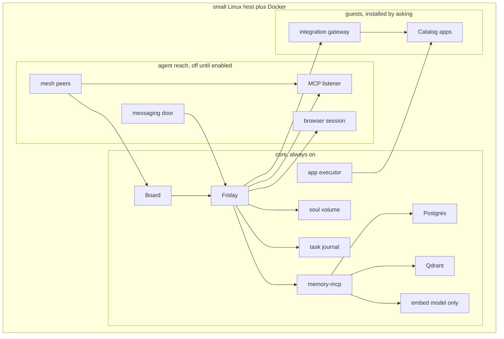

# Architecture

**Status: draft. This describes the target design, not a built system.**
`image/` is the v0.0.1 test installer, and [install.md](install.md) is
how to flash it. That image does not contain Friday, the Board, the
memory service, Qdrant, Postgres, Ollama, or Docker. The image build in
this tree packs Docker Engine and that core, and it refuses to finish
if the payload is missing. It also packs the webhook receiver, the
gateway, a catalog snapshot, a display kiosk, and Wi-Fi join. A QEMU
boot of that image printed “The core on this computer was started.
Nothing was downloaded.” The serial log did not say those five pieces
were omitted. The compressed file is over the GitHub release limit, so
v0.0.1 remains the published download.

The customer-facing picture of the same target, including what this
repository implements today, is [system.md](system.md).

## Three layers

| Layer | Rule |
|---|---|
| **Core** | Always installed, small RAM footprint, cannot be removed. Friday, the Board, memory, the executor, and the task journal. `friday/`, `board/`, `memoryd/`, and `executor/` are those processes. Compose builds them. `scripts/bootstrap-memory.sh` creates the memory collections. `gate/` and `sql/approvals.sql` are the approval rules. `webhooks/` stores an app event and keeps its body out of the prompt. With `POSTGRES_HOST` set it calls `webhook_store`. `sql/webhooks.sql` is the table. `image/assets/core-compose.yml` starts that receiver on the internal apps network and on core, and publishes no host port. It does not proxy to Postgres. The dev `compose.yml` does not. With `POSTGRES_HOST` set, `memoryd/` calls `memory_save` and indexes Qdrant. A credential-shaped save is refused and nothing is written. `qdrant_store` is refused. Without that host, notes stay in a file. The executor does not call the host Docker daemon. A caller-supplied runtime creates the container step. Without a runtime it does not start a container. |
| **Agent reach** | Part of the product, off until the owner turns each piece on. The messaging door, the mesh, MCP in both directions, and the browser session. None of these is a catalog app, and none of them can mint an approval. |
| **Optional apps** | Guests, not the front of the product. A menu rendered from a pinned snapshot of [`truenas/apps`](https://github.com/truenas/apps) (community and stable trains only), plus Mattermost, Taskrunner, and a Cloudflare tunnel. An id installs only when it is on the allowlist, has a wire, and has passed a render test. Nothing in this layer starts until the owner approves that exact operation. |

Off until the owner turns them on: the messaging door, the mesh, MCP
grants, and the browser session. Those are the agent, not optional apps.
Left out of the product's front on purpose: Mattermost as a required
room, media servers (Plex, Jellyfin), the `*arr` stack, Home Assistant,
Coder/Taskrunner, a public tunnel, and any chat-sized local language
model. A catalog app is installed only after the core boots and the
owner approves that one app. A template that needs host networking,
host PID, host IPC, or a device or capability the reviewed manifest
does not list is refused and stays listed. The first catalog guests,
after the agent path exists, are one media player and Home Assistant.
`guests/home.py` records the Home Assistant entry and does not install it.

## Core pieces

| Piece | Role | Footprint |
|---|---|---|
| Friday | The only mouth. No host port. The Board calls it on the compose network. Reads memory through the memory service, plus core health and the app registry. A stay with one charter lasts until the owner says back to Friday. "stay with that advisor" keeps the charter from the latest one-turn address. The reply starts with that charter's name. The stay is not a note. `cabinet/enable.py` records one inactive charter and does not copy the file. The Board page records the same link and does not call that module. Family stays blocked. | One process |
| Board | The screen of the OS, drawn at `127.0.0.1:8080`. Discover lists app directory names from the snapshot packed in the image and does not read file text. Install stays closed. Health, grants, Friday's ask box, and one ask box for each of the six starter advisors. The chief's box calls the same Friday. A credential-shaped question is not sent. Job cap stays 0. A secret stored on that page is shown by name only. The page does not start taskrunner. It shows an update as not applied. No key is configured. Login is the Board password. The OpenAI-compatible URL is the model. Open WebUI and LibreChat are not part of the OS. | One small Node process |
| Qdrant | Semantic memory, cosine similarity, 768 dimensions, vectors on disk | Small while collections are empty |
| Ollama (`nomic-embed-text` only) | Turns a sentence into a vector. Chat itself never runs a local model. | The largest core piece on disk |
| memory-mcp + Postgres | The durable `memories` row, id shared with the Qdrant point. Holds the Qdrant key and applies the owner filter. Friday does not. | One small database |
| Soul volume + Friday SQLite | Character, charters, conversations, obligations. `memoryd/soul.py` records a proposal for `SOUL.md` or `CHAPTER.md` and does not write the example file. The Board page records one proposal and applies it only when the presented token matches. The token is not stored. A week flag does not apply it by itself. The file is not written. Chat cannot record or apply one. Friday's ask path does not call it. `friday/state.py` records the conversation, one obligation thread, reminders, deliveries, and a coder-job mirror in the process and does not open SQLite. `friday/durable.py` writes that book to the file named by `FRIDAY_STATE`. The image sets `/data/friday.sqlite` on the friday volume. A new open sees the rows. Without the path, a restart drops the book. It does not send and does not start taskrunner. The ask module does not call either file. The Friday process records a spoken or waiting turn when the path is set | Files on disk |
| App executor | A process separate from the chat process. Accepts a named operation only when an approval record matches it exactly — never a raw shell string or an arbitrary Compose file. | One small container, no model and no page fetcher |
| Task journal | Goals that outlive a turn, and the machine operations above. Same crash rule: resume the journal, never mint a second approval. | Rows next to the operation journal |

First boot is this Board, the screen of the OS, on a monitor attached
to the machine. The screen opens before a network link exists. The
owner connects a cable or joins Wi-Fi, then creates the server: the
screen starts the core that shipped in the image, and this computer is
that server. Nothing in the core is downloaded, and the Board stays at
`127.0.0.1:8080`. After the model key returns a real reply and the
embed check passes, Friday speaks first on that same screen and asks
what to set up. An ordinary turn posts the owner's fast model name.
The think name is posted only when think is exactly true and that name
is set. A credential-shaped name is refused and is not stored. No model
id is baked in. The character and the Cabinet
roles are already in the image. The owner's notes start empty. A step
that sends, pays, deletes, publishes, installs, or changes the machine
waits for the owner on that page.

## The key boundary: chat never performs the action

Anything that sends, pays, deletes, publishes, or changes the machine
goes through an approval record. Installing an app, changing a grant,
and running a backup also go through the executor. A model argument
such as `confirmed=true` is never sufficient. The approval record is
created by the owner on the Board, after authenticating with the Board
password. The chat process, a messaging door, and an outside MCP caller
cannot create or exchange it.

A machine approval stores the operation name, the app id, the reviewed
manifest version (catalog pin, template hash, rendered digest), the
image digest, the canonical mount list, the ports, the privileges, the
devices, and the network mode. A life-step approval stores the action
class (send, pay, delete, or publish), the target, and a digest of the
payload the owner was shown. Either record expires after ten minutes
and can be exchanged once. Any change to those fields voids the record.
`gate/` and `sql/approvals.sql` implement that record. They do not start
a container. With POSTGRES_HOST set, the executor calls approval_store
and approval_exchange_owner. Without that host the process file remains.
A second exchange of the same body keeps the operation id. A different
body voids that row and does not rewrite an exchanged one. A forbidden
mount and a credential-shaped target are refused before the connection
opens. Chat cannot create or exchange one. Nothing is sent. Friday's
ask path does not call it. The image compose mounts sql/approvals.sql
for a new data directory. The unit test uses a stub connection.

Exchanging an approval is one transaction: the record moves from `approved`
to `exchanged`, and an operation journal row is inserted with a new
operation id and the ordered steps to run. The Board page exchanges one
life step, send, pay, delete, or publish, and does not send it. Chat
cannot exchange one. A machine change is not exchanged from that button.
Catalog install stays closed. Friday's ask path does not call it. Every Docker object a step
creates carries a label naming that journal. The label does not mean
the operation finished. `gate/recover.py` compares the journal with
objects the caller supplies. A caller-supplied runtime creates the
container step. Applied is recorded only when that runtime says the
container is up. A second resume does not create it again. It does not
inspect Docker and does not call the host Docker daemon. Without a
runtime it does not create a container. Applied is written only when
every postcondition holds. A labeled network and volume, without a
running container, stay
unapplied. A container that is already stopped is not stopped again.
Two labeled containers block the journal. The resume does not mint a
second approval.

## Network segmentation

Compose networks separate the trusted core, guest apps, the door, and
the browser session:

| Network | Carries |
|---|---|
| `core` | Friday, Board, Qdrant, Postgres, Ollama, memory-mcp, and the executor's control listener |
| `apps` | Optional apps, the webhook receiver, and an integration gateway |
| `doors` | The messaging door and the inbound MCP listener. Internal, so it has no route to `core`. Friday is also attached here so a turn can reach `/ask` |
| `browser` | The disposable browser session, internal, with no route to `core`. The image compose file lists it under profile `reach`. The dev `compose.yml` does not |

The executor sits on both networks so it can health-check an app by its
Compose DNS name and container port, and so an approved operation can
reach that container directly. Friday itself is **not** on the `apps`
network. Friday is on `core` and on `doors`. The door and the MCP
listener are the other members of `doors`, and only when profile
`reach` is started. Creating the server does not start that profile. Advisors reach an app only through the gateway, which also sits
on both networks and allows only the method and path a wire file names
for that advisor. `guests/call.py` records that the Board asked that named advisor to make one call. The sentence is "An API call was asked." The call is not made and the gateway is not opened. The diagram shows that split: Friday's request goes
through the gateway, and the executor's health check goes to the app.
`netpolicy/paths.py` decides that split from names and ports the caller
supplies. An app may open `webhooks` on port 8080. Opening Postgres,
Qdrant, Friday, memory-mcp, the executor, or the gateway is
`core_closed`. The executor may health-check an app name such as
`jellyfin` on port 8096. An advisor opens `gateway` on port 8090 only
when the wire allows that call. A browser name resolves to `internet`
for a public host and to `core_closed` for a core service. The function
does not resolve DNS and does not create a Docker network.

`scripts/prove-isolation.sh` starts Postgres on a throwaway bridge and
an app container on a throwaway internal network. The app cannot
resolve the Postgres name and cannot open port 5432. A container on
the Postgres network can open it. A container attached to both
networks can open it. That second attachment is the executor's
position. The app network is internal because, on the Docker that ran
this proof, a second ordinary bridge still forwarded the address.
`image/assets/core-compose.yml` puts the executor and the gateway on
`core` and on an internal `apps` network, and the webhook receiver on
`apps` only. Friday is on `core` and on an internal `doors` network.
The messaging door and the inbound MCP listener are the other members
of `doors`, under profile `reach`. The file publishes no host port for
the gateway, the webhook receiver, the door, or the listener. Creating
the server does not start profile `reach`. The browser session is the only member of an internal `browser` network, also under profile `reach`, and the file publishes no host port for it. A later QEMU boot of the image that lists it printed “The core on this computer was started. Nothing was downloaded.” It did not report that profile reach had started. The setup screen still said the embed check was not checked, and setup was not finished. The
dev `compose.yml` still has the executor on `core` only. The approval gate
refuses a host network and a mount that resolves outside the app
disk, including through a symlink. v0.0.1 does not contain these
networks.

An adopted app is called at an owner-supplied base URL. `vet_adopted`
refuses a core service name, a link-local address (that range covers
169.254.169.254), or `metadata.google.internal`. A private LAN address
can be an adopted app. A mesh peer is held to the same line in
`doors/reach.py`: it may open the Board and the authenticated MCP
listener, and it may not open Postgres, Qdrant, or the executor's
control port. Joining the mesh is not joining `core`.

The webhook receiver is the only process an app may call, and only with
the header `Friday-Webhook`. `webhooks/secret.py` records one generated
secret for Jellyfin, Radarr, or Sonarr and returns the name only. The
value stays in the process. Radarr and Sonarr do not share a secret. A
credential-shaped draw is not stored, except the 64-character hex
secret. It does not post the webhook.
`webhooks/receiver.py` and
`sql/webhooks.sql` store one typed event. With `POSTGRES_HOST` set the
row is `webhook_store`. The raw body stays out of
the prompt. Friday reads a grab, a failure, a health change, or any
other event as one fixed sentence from `GET /announcements`. The body
is not in that read. The ask path does not call it. The Board lists
the sentences. Chat cannot post one. The receiver does not call the
executor and does not write an approval. The dev `compose.yml` has no
webhooks container and no `apps` network. The image compose attaches
the receiver to `apps` and to `core` and publishes no host port. It
does not proxy to Postgres.
`app_can_open("friday", 8080)` returns
`core_closed`. `scripts/prove-isolation.sh` is the packet check for
Postgres. The image compose sets `BIND_HOST` to `core` and `CORE_PEER`
to `postgres` on the executor and the gateway, so each process listens
on the address it uses to reach Postgres. An app on `apps` is given the
other address. `scripts/prove-reach.sh` builds throwaway images and
checks that split: from the app network the executor, the gateway,
Postgres, and Qdrant stay closed by name and by address; from core the
executor answers `/health` and `GET /jellyfin/health` on the gateway
returns the app's health body; a container on both networks reads
`http://jellyfin:8096/health`; a `POST` to the gateway path is refused; a
Jellyfin post and a Radarr post to the webhook receiver come back as
the fixed sentences. That check ran on the build machine. Before the starter reports that
the core was started, it asks `http://executor:8080/health` and
`http://gateway:8090/health` from the core network. A QEMU boot of
this image printed the start sentence and did not report a listener
failure. The setup screen still said the embed check was not checked.
A later image adds the messaging door and the inbound MCP listener on an internal `doors` network under profile `reach`, with no host port. A QEMU boot of that image printed the start sentence. The serial capture ends at “The core on this computer was started.” It did not report a listener failure and did not report that profile `reach` had started. Creating the server does not start that profile. The setup screen still said the embed check was not checked. A later image also packs the browser session on an internal `browser` network under the same profile, with no host port. A QEMU boot of that image printed “The core on this computer was started. Nothing was downloaded.” It did not report that profile `reach` had started. The setup screen still said the embed check was not checked, and setup was not finished.

## Approval and mount safety rules

- The system disk is an EFI partition, two system slots, and a data
  partition. The first image target is one x86_64 disk of at least 64 GB:
  512 MB EFI, two 16 GB system slots, and a data partition that fills the
  rest, with at least 16 GB free after install. The v0.0.1 installer
  writes that layout and boots slot A. It records slot B and does not
  switch to it.
- The data partition holds the machine id, secrets, Postgres, Qdrant,
  SQLite, the soul, the executor journal, and free space for one
  pre-upgrade backup. An upgrade refuses to start when that free space is
  smaller than the live databases. `backup/coordinated.py` pauses
  writers before the copy, refuses a live SQLite file, and keeps the
  passphrase out of the manifest. `backup/sqlite.py` copies one open
  connection with the SQLite backup API into a destination the executor
  already opened, including one named file-backed connection. A path is
  not opened. A byte copy of a live file stays refused. An unnamed
  temporary disk database stays refused. It does not open a file. Movie files are excluded. The upgrade
  writes the inactive slot. A failed `/ready` restores that backup
  before the old slot boots. `updates/packages.py` refuses an open-ended apt upgrade, including a different case of that command, a sudo user, or an env prefix, and does not contact a mirror. A reflash is a new install, not that slot write, and it does not erase a disk. Chat cannot run either call. A blank-host restore loads a caller-supplied
  manifest onto a new box, returns the same memory, and holds a pending
  delivery until the provider is asked. It does not restart the box that
  sealed the manifest, and it does not start a container. With POSTGRES_HOST set, the executor records one manifest through backup_store. Without that host the manifest stays in memory. The image compose gives the executor the Postgres settings and mounts sql/backup.sql for a new data directory. Chat cannot record one. Friday's ask path does not import it. Compose has no
  backup service.
- App mounts are canonicalized (symlinks included) and must fall under the
  app storage disk the owner names when approving that app. That disk is
  a different device from the data partition. Downloads, video files, and
  app config are refused on the data partition.
- `/`, `/etc`, the owner's home, the secrets volume, the soul volume, the
  SQLite directory, the Docker data root, and the Docker socket are always
  outside the app storage disk and are refused.
- Host network, host PID, and host IPC modes are refused.
- A device or capability not listed in the reviewed manifest is refused.
- Ports bind to `127.0.0.1` on the host unless a separate, later
  publication approval names that route explicitly.
- The image architecture must match the host, and the declared memory must
  fit the caller's free RAM. `measure/ram.py` decides that fit from numbers
  the caller supplies. A complete sample is recorded as
  `not_a_hardware_measurement`. Two gigabytes is the measurement target.
  When declared memory is above the caller's free RAM, it names one other
  guest that would free enough, or says the machine is too small. A core
  flag other than false keeps that guest off the list. A credential-shaped
  name is not repeated. It does not stop that guest and does not pull.
  The Board page shows those supplied numbers before an install button
  is offered. It does not stop that guest and it does not pull. Catalog
  install stays closed. Friday's ask path does not call it.
  `catalog/render.py` judges those rules from a description the caller
  supplies. It does not render Jinja, does not read the draft wires,
  does not write `catalog/PIN`, and does not install. An app that needs
  TrueNAS middleware is refused and stays listed. A ZFS dataset is
  refused, and a folder path standing in for that dataset is refused.
  The architecture strings are the caller's, not a measurement of this
  machine. `catalog/propose.py` records one draft wire an advisor
  supplies. Tools stay off until the Board accepts that name. It does
  not read the draft wires, does not render a template, and does not
  install.

## Task journal

The operation journal and the task journal are one mechanism with two
kinds of work.

| Kind | Examples | Who may run a step |
|---|---|---|
| Machine | Install, uninstall, grant, backup, publish a port, publish a hostname | The executor, after one approval exchange |
| Life | A goal the owner stated, research, a draft, a booking, a message | Friday, in the role the owner addressed, until a step is sensitive |

A sensitive step is send, pay, delete, publish, or any machine change.
That step waits. Drafting, recalling, and calling a tool the owner
already granted do not wait for a new record. The journal row stores
the owner, the role, the goal, the ordered steps, and a state of
`ready`, `running`, `waiting`, `done`, or `blocked`. Recovery follows
the operation-journal rule: check the step's postcondition, resume
idempotently, never mint a second approval, never repeat a step that
already succeeded. In this tree that check is `gate/recover.py`, and
the objects come from the caller. A caller-supplied runtime creates the
container step. Applied is recorded only when that runtime says the
container is up. A second resume does not create it again. The host
Docker daemon is not called. Without a runtime the resume does not
create a container. A recorded step claim does not by itself write
`applied`.

A task cannot widen its own grant. A new tool name discovered while the
task is running stays off until the owner accepts it on the Board.
`gate/journal.py` records that name as off. The Board may accept it.
Chat cannot, and accepting one name does not accept another. The tool
is not run. A page, webhook, or tool body is stored as evidence and
does not replace the goal. The door is told working, waiting, or done.
A sensitive step stays waiting until an approval for that step and that
same owner is already exchanged. A different owner's approval does not
finish it. A different case of that step name still waits. A flag on
the call is not that record. A credential-shaped owner or role is not
stored. The module does not create an approval, does not write Postgres,
and Friday's ask path does not call it.

## Doors

| Door | Binds to | Approval |
|---|---|---|
| Board | `127.0.0.1:8080`, and the same page over the mesh after the owner joins a phone | Creates and exchanges approvals |
| Messaging adapter | Friday's internal ask path | None. Turns in, "waiting" and "done" out |
| Tunnel | The Board, behind a verified access check | The Board's password. The tunnel is not itself a login |

The messaging adapter cannot call the executor, write an approval, or
read Postgres. Mattermost and a token-based chat app are implementations
of this adapter. Neither one is required for Friday to answer on the
Board. No adapter is enabled at first boot. `doors/reach.py` records
the adapter, the mesh, and the tunnel. The tunnel decision stays off.
`doors/hostnames.py` records one public name at a time and does not
start a tunnel. A failed check removes that name.
`doors/server.py` listens when `DOOR_ENABLED` is `yes`. It calls
Friday's `/ask` and returns the reply fields. It has no executor URL
and no Postgres URL. `doors/token.py` records one generated secret for
that adapter and returns the name `DOOR_TOKEN` only. A caller-supplied
value is not stored. Chat cannot record one. The value stays in the
process. It is not the notify token and it is not the inbound MCP
token. Recording it does not start the door and does not create an
approval. The server still reads the environment and does not call
that record. Friday's ask path does not call it. The image compose file puts it on the internal
`doors` network under profile `reach` and publishes no host port.
`scripts/prove-door.sh` checks that split on throwaway networks. The
dev `compose.yml` has no `doors` network. Setup can leave the Board on this computer, join an existing Headscale, or run Headscale here. The mesh stays quiet until that choice.

## Devices

A mesh peer is a machine the owner pre-authorizes and means to keep: a
phone, a laptop, this box. The peer may expose an MCP endpoint. That
endpoint is a grant (address, secret reference, role, tool names), not
a mount. Friday does not attach the peer's filesystem, a USB device,
host networking, or the Docker socket. `doors/peers.py` records one
pre-auth key for a phone or a laptop and returns the name only. A
caller-supplied value is not stored. The key is not reused for a coder
machine. Tools on that endpoint stay off until the Board accepts that
name. The module does not call Headscale and does not open a socket.

Ephemeral code machines register and are removed with the job. Cleanup
of those names must not delete a permanent peer. `remove_node` in
`doors/reach.py` skips that deletion while Headscale is absent, refuses
a phone, a laptop, and a NAS, and keeps a failed coder node for three
hours. It does not open a socket. Setup can leave the Board on this computer, join an existing Headscale, or run Headscale here. The mesh stays quiet until that choice.

## MCP

Friday is an MCP client and an MCP server.

Outbound, a grant names the server URL, the secret reference, the role,
and the tool names. Tool definitions the grant does not list are not
inserted into the model prompt. This holds when the server would
otherwise advertise every tool it has.

Inbound, the caller presents a per-harness token. `mcpbus/token.py` records one generated secret and returns the name `MCP_TOKEN` only. A caller-supplied value is not stored. Chat cannot record one. The value stays in the process. It is not the notify token and it is not the messaging-door token. Recording it does not start the listener and does not create an approval. The server still reads the environment and does not call that record. Friday's ask path does not call it. Recall goes through
Friday's `/recall`, which calls the memory service: owner filter
required, at most 8 notes. A mutating call returns waiting and is not
executed. It does not create an approval. The listener sits on
`doors`, not on the network that holds Postgres. The caller does not
receive the Qdrant key. `mcpbus/server.py` listens when `MCP_ENABLED`
is `yes`. The image compose file keeps it under profile `reach` and
publishes no host port.

A catalog wire is an outbound grant whose "tools" are the method and
path in that wire. The acceptance rule is the same: a new name stays
off until the owner accepts it. `mcpbus/grants.py` is that decision.
`mcpbus/ref.py` records one generated secret for that call and returns the name `MCP_SECRET_REF` only. A caller-supplied value is not stored. Chat cannot record one. The value stays in the process. It is not the notify token, the messaging-door token, or the inbound MCP token. Recording it does not call the server and does not create an approval. Friday's ask path does not call it. `mcpbus/outbound.py` calls one granted server when `OUTBOUND_ENABLED` is `yes` and does not call that record. The tool list is the granted names the server also offers. A mutating call waits and is not sent. The image compose file lists that process on an internal outbound network under profile `reach`, with no host port. Creating the server does not start that profile. A QEMU boot of the image that lists it printed “The core on this computer was started. Nothing was downloaded.” It did not report that profile reach had started. The setup screen still said the embed check was not checked, and setup was not finished. Grants do
not open a listener and do not create an approval.

## Browser session

The session is a disposable browser container on the `browser` network.
It has no host mount, no host network, no host PID, no host IPC, and no
Docker socket. Its only privileged hop is a credential broker that
injects the vault entry for the site of that session. The model
receives page text. It does not receive the secret.
`browser/broker.py` records one generated secret for one site and returns the name `SITE_CREDENTIAL` only. A caller-supplied value is not stored. Chat cannot record one, and that refusal leaves a secret already recorded. The value stays in the process. It is not placed on the environment. It is not the notify token, the messaging-door token, or the inbound MCP token. The model is not given the value. A core name, a loopback address, including an abbreviated spelling, and a link-local address are refused. Recording it does not fetch a page, does not start a browser, and does not create an approval. The server still reads the environment and does not call that record. Friday's ask path does not call it.

Send, pay, delete, and publish inside the session are sensitive steps.
They wait for an approval record that names the action. The session is
discarded when the task finishes or the owner stops it. A page fetched
this way is evidence, under the same rule as a webhook body.
`browser/session.py` keeps the secret with the broker and lets read and
draft proceed. It records one page as evidence, "A page was read.", and
does not keep the vault secret. The raw page is not the goal. The Board
discards that session when the owner stops it. The executor discards it
when the task finishes. Chat cannot, and that refusal leaves the page.
A different case of that reason leaves the page. It does not fetch,
does not start a browser, and Friday's ask path does not call it.
`browser/server.py` fetches one page when
`BROWSER_ENABLED` is `yes` and removes the vault secret from that text.
It does not call that record.
Send, pay, delete, and publish return waiting and are not fetched. The
process does not create an approval. The image compose file lists it
on an internal `browser` network under profile `reach` and publishes
no host port. Creating the server does not start that profile.
`scripts/prove-browser.sh` checks that on throwaway networks. A later QEMU boot of the image that lists it printed “The core on this computer was started. Nothing was downloaded.” It did not report that profile reach had started. The setup screen still said the embed check was not checked, and setup was not finished.

## What this repo is building toward

See the repo README for the Compose profiles and the build order. The
task journal, doors, mesh peers, MCP bus, and browser session are in
that order after the gate, and ahead of catalog guests. This document
describes the target. The image compose file lists the messaging door
and the inbound MCP listener under profile `reach`. The dev
`compose.yml` does not. The image compose file lists the browser
session under profile `reach`. The mesh has no service. The Helm chart is files for an existing cluster, not a Compose service. The
decisions are in `doors/`, `mcpbus/`, `browser/`,
`guests/`, and `updates/`. `guests/registry.py` reads caller-supplied
app rows and does not probe a health URL or stop an adopted app.
Friday's ask path does not call it. `guests/known.py` records one log for a known app. The sentence is "Logs were read." The cleaned log is evidence under that sentence and is not a goal. A credential-shaped log is not stored, including a percent-encoded or plus-encoded copy. Chat cannot record one, and that refusal leaves the row. It does not read a container. Friday's ask path does not call it. `guests/start.py` records that the Board asked to start one known managed app. The sentence is "A start was asked." The container is not started. An adopted app is not started. Chat cannot record one, and that refusal leaves the row. A second record keeps the first name. A credential-shaped name or note is not stored, including a percent-encoded or plus-encoded copy. "The password is kept outside the machine" can be a note. Pull is not this record. Friday's ask path does not call it. `guests/stop.py` records that the Board asked to stop one known managed app. The sentence is "A stop was asked." The container is not stopped. An adopted app is not stopped. Chat cannot record one, and that refusal leaves the row. A second record keeps the first name. A credential-shaped name or note is not stored, including a percent-encoded or plus-encoded copy. "The password is kept outside the machine" can be a note. Deleting the files is not this record. The registry stop still returns not_stopped and does not change the row. `guests/pull.py` records that the Board asked to pull one known managed app. The sentence is "A pull was asked." The image is not pulled. An adopted app is not pulled. Chat cannot record one, and that refusal leaves the row. A second record keeps the first name. A credential-shaped name or note is not stored, including a percent-encoded or plus-encoded copy. "The password is kept outside the machine" can be a note. Starting and stopping are not this record. Friday's ask path does not call it. `guests/call.py` records that the Board asked the named advisor to call one known app, including an adopted app. The sentence is "An API call was asked." The call is not made and the gateway is not opened. The named advisor is media for Jellyfin and Plex, fetcher for Radarr, Sonarr, Prowlarr, qBittorrent, and Bazarr, and home for Home Assistant. A tool stays off until the Board accepts that name. Accepting one name does not accept another, and it does not accept that name for another app. Chat cannot record or accept one, and that refusal leaves the row and an accepted name. A second record keeps the first tool and the first note. A credential-shaped name, advisor, tool, or note is not stored, including a percent-encoded or plus-encoded copy. "The password is kept outside the machine" can be a note. Starting, stopping, and pulling are not this record. Refusing the call does not stop qBittorrent's swarm. Friday's ask path does not call it. `guests/upgrade.py` records that the Board asked to upgrade one known managed app. The sentence is "An upgrade was asked." The image is not upgraded and the container is not restarted. A new tool stays off until the Board accepts that name. Accepting one name does not accept another. An adopted app is not upgraded. Chat cannot record or accept one, and that refusal leaves the row and an accepted name. A second record keeps the first note and the first tool list. A credential-shaped name, tool, or note is not stored, including a percent-encoded or plus-encoded copy. "The password is kept outside the machine" can be a note. Pulling, starting, stopping, and calling are not this record. Refusing the upgrade does not stop qBittorrent's swarm. Applying it returns catalog_install_closed. Friday's ask path does not call it. `guests/accounts.py` tells an
unknown person, or a person with no fitness token, to connect an
account and does not write the owner's tracker. It does not create the
messages collection, and it does not embed a video, a photo, or a
download. `guests/lifecycle.py` `record_removal` records that the Board removed a managed app's grants and one tunnel name. The library stays. The container is not stopped. A separate confirm does not delete the files. Chat cannot record either. It does not call Cloudflare. Friday's ask path does not call it. `guests/bundle.py` records the Movies and TV wiring plan and
does not apply it. Catalog install stays closed. Friday's ask path
does not call either module.
