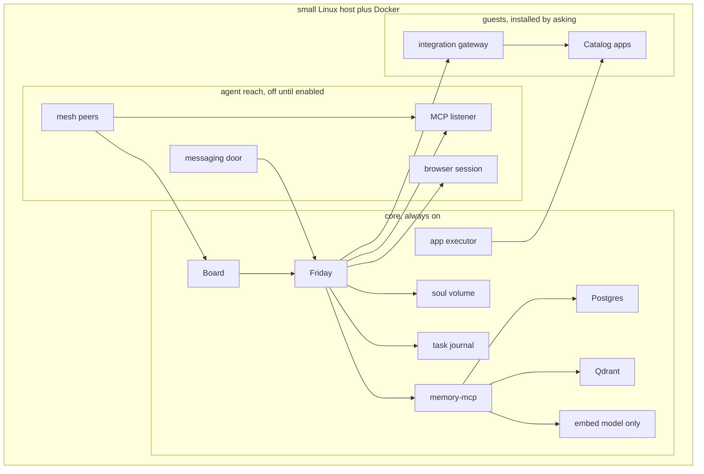

# Architecture

**Status: draft. This describes the target design, not a built system.**
`image/` is the v0.0.1 test installer, and [install.md](install.md) is
how to flash it. That image does not contain Friday, the Board, the
memory service, Qdrant, Postgres, Ollama, or Docker. The image build in
this tree packs Docker Engine and that core, and it refuses to finish
if the payload is missing. It also packs the webhook receiver, the
gateway, a catalog snapshot, a display kiosk, and Wi-Fi join. A QEMU
boot of that image printed “The core on this computer was started.
Nothing was downloaded.” The serial log did not say those five pieces
were omitted. The compressed file is over the GitHub release limit, so
v0.0.1 remains the published download.

The customer-facing picture of the same target, including what this
repository implements today, is [system.md](system.md).

## Three layers

| Layer | Rule |
|---|---|
| **Core** | Always installed, small RAM footprint, cannot be removed. Friday, the Board, memory, the executor, and the task journal. `friday/`, `board/`, `memoryd/`, and `executor/` are those processes. Compose builds them. `scripts/bootstrap-memory.sh` creates the memory collections. `gate/` and `sql/approvals.sql` are the approval rules. `webhooks/` stores an app event in memory and keeps its body out of the prompt. `sql/webhooks.sql` is the table definition. `image/assets/core-compose.yml` starts that receiver on the internal apps network and publishes no host port. The dev `compose.yml` does not. With `POSTGRES_HOST` set, `memoryd/` calls `memory_save` and indexes Qdrant. Without that host, notes stay in a file. The executor does not start a container. |
| **Agent reach** | Part of the product, off until the owner turns each piece on. The messaging door, the mesh, MCP in both directions, and the browser session. None of these is a catalog app, and none of them can mint an approval. |
| **Optional apps** | Guests, not the front of the product. A menu rendered from a pinned snapshot of [`truenas/apps`](https://github.com/truenas/apps) (community and stable trains only), plus Mattermost, Taskrunner, and a Cloudflare tunnel. An id installs only when it is on the allowlist, has a wire, and has passed a render test. Nothing in this layer starts until the owner approves that exact operation. |

Off until the owner turns them on: the messaging door, the mesh, MCP
grants, and the browser session. Those are the agent, not optional apps.
Left out of the product's front on purpose: Mattermost as a required
room, media servers (Plex, Jellyfin), the `*arr` stack, Home Assistant,
Coder/Taskrunner, a public tunnel, and any chat-sized local language
model. A catalog app is installed only after the core boots and the
owner approves that one app. A template that needs host networking,
host PID, host IPC, or a device or capability the reviewed manifest
does not list is refused and stays listed. The first catalog guests,
after the agent path exists, are one media player and Home Assistant.

## Core pieces

| Piece | Role | Footprint |
|---|---|---|
| Friday | The only mouth. No host port. The Board calls it on the compose network. Reads memory through the memory service, plus core health and the app registry. | One process |
| Board | The screen of the OS, drawn at `127.0.0.1:8080`. Discover, health, grants, and the ask box. Login is the Board password. The OpenAI-compatible URL is the model. Open WebUI and LibreChat are not part of the OS. | One small Node process |
| Qdrant | Semantic memory, cosine similarity, 768 dimensions, vectors on disk | Small while collections are empty |
| Ollama (`nomic-embed-text` only) | Turns a sentence into a vector. Chat itself never runs a local model. | The largest core piece on disk |
| memory-mcp + Postgres | The durable `memories` row, id shared with the Qdrant point. Holds the Qdrant key and applies the owner filter. Friday does not. | One small database |
| Soul volume + Friday SQLite | Character, charters, conversations, obligations | Files on disk |
| App executor | A process separate from the chat process. Accepts a named operation only when an approval record matches it exactly — never a raw shell string or an arbitrary Compose file. | One small container, no model and no page fetcher |
| Task journal | Goals that outlive a turn, and the machine operations above. Same crash rule: resume the journal, never mint a second approval. | Rows next to the operation journal |

First boot is this Board, the screen of the OS, on a monitor attached
to the machine. The screen opens before a network link exists. The
owner connects a cable or joins Wi-Fi, then creates the server: the
screen starts the core that shipped in the image, and this computer is
that server. Nothing in the core is downloaded, and the Board stays at
`127.0.0.1:8080`. After the model key returns a real reply and the
embed check passes, Friday speaks first on that same screen and asks
what to set up. The character and the Cabinet
roles are already in the image. The owner's notes start empty. A step
that sends, pays, deletes, publishes, installs, or changes the machine
waits for the owner on that page.

## The key boundary: chat never performs the action

Anything that sends, pays, deletes, publishes, or changes the machine
goes through an approval record. Installing an app, changing a grant,
and running a backup also go through the executor. A model argument
such as `confirmed=true` is never sufficient. The approval record is
created by the owner on the Board, after authenticating with the Board
password. The chat process, a messaging door, and an outside MCP caller
cannot create or exchange it.

A machine approval stores the operation name, the app id, the reviewed
manifest version (catalog pin, template hash, rendered digest), the
image digest, the canonical mount list, the ports, the privileges, the
devices, and the network mode. A life-step approval stores the action
class (send, pay, delete, or publish), the target, and a digest of the
payload the owner was shown. Either record expires after ten minutes
and can be exchanged once. Any change to those fields voids the record.
`gate/` and `sql/approvals.sql` implement that record. They do not start
a container.

Exchanging an approval is one transaction: the record moves from `approved`
to `exchanged`, and an operation journal row is inserted with a new
operation id and the ordered steps to run. Every Docker object a step
creates carries a label naming that journal. Recovery after a crash checks
each journaled step for the resources and state it was supposed to leave
behind, and resumes idempotently — it never mints a second approval and
never creates a second container for a step that already succeeded.

## Network segmentation

Three Compose networks separate the trusted core, guest apps, and the
browser session:

| Network | Carries |
|---|---|
| `core` | Friday, Board, Qdrant, Postgres, Ollama, memory-mcp, and the executor's control listener |
| `apps` | Optional apps, the webhook receiver, and an integration gateway |
| `browser` | The disposable browser session, with a route to the public internet and no route to `core` |

The executor sits on both networks so it can health-check an app by its
Compose DNS name and container port, and so an approved operation can
reach that container directly. Friday itself is **not** on the `apps`
network. Advisors reach an app only through the gateway, which also sits
on both networks and allows only the method and path a wire file names
for that advisor. The diagram shows that split: Friday's request goes
through the gateway, and the executor's health check goes to the app.
`netpolicy/paths.py` decides that split from names and ports the caller
supplies. An app may open `webhooks` on port 8080. Opening Postgres,
Qdrant, Friday, memory-mcp, the executor, or the gateway is
`core_closed`. The executor may health-check an app name such as
`jellyfin` on port 8096. An advisor opens `gateway` on port 8090 only
when the wire allows that call. A browser name resolves to `internet`
for a public host and to `core_closed` for a core service. The function
does not resolve DNS and does not create a Docker network.

`scripts/prove-isolation.sh` starts Postgres on a throwaway bridge and
an app container on a throwaway internal network. The app cannot
resolve the Postgres name and cannot open port 5432. A container on
the Postgres network can open it. A container attached to both
networks can open it. That second attachment is the executor's
position. The app network is internal because, on the Docker that ran
this proof, a second ordinary bridge still forwarded the address.
`image/assets/core-compose.yml` puts the executor and the gateway on
`core` and on an internal `apps` network, and the webhook receiver on
`apps` only. Friday stays on `core`. No host port is published for the
gateway or the webhook receiver. There is no `browser` network. The
dev `compose.yml` still has the executor on `core` only. The approval gate
refuses a host network and a mount that resolves outside the app
disk, including through a symlink. v0.0.1 does not contain these
networks.

An adopted app is called at an owner-supplied base URL. `vet_adopted`
refuses a core service name, a link-local address (that range covers
169.254.169.254), or `metadata.google.internal`. A private LAN address
can be an adopted app. A mesh peer is held to the same line in
`doors/reach.py`: it may open the Board and the authenticated MCP
listener, and it may not open Postgres, Qdrant, or the executor's
control port. Joining the mesh is not joining `core`.

The webhook receiver is the only process an app may call, and only with
the header `Friday-Webhook`. `webhooks/receiver.py` and
`sql/webhooks.sql` store one typed event and keep the raw body out of
the prompt. Friday announces a grab, a failure, a health change, or any
other event with one fixed sentence. The receiver does not call the
executor and does not write an approval. The dev `compose.yml` has no
webhooks container and no `apps` network. The image that booted starts
both on the internal apps network and publishes no host port.
`app_can_open("friday", 8080)` returns
`core_closed`. `scripts/prove-isolation.sh` is the packet check for
Postgres.

## Approval and mount safety rules

- The system disk is an EFI partition, two system slots, and a data
  partition. The first image target is one x86_64 disk of at least 64 GB:
  512 MB EFI, two 16 GB system slots, and a data partition that fills the
  rest, with at least 16 GB free after install. The v0.0.1 installer
  writes that layout and boots slot A. It records slot B and does not
  switch to it.
- The data partition holds the machine id, secrets, Postgres, Qdrant,
  SQLite, the soul, the executor journal, and free space for one
  pre-upgrade backup. An upgrade refuses to start when that free space is
  smaller than the live databases. `backup/coordinated.py` pauses
  writers before the copy, refuses a live SQLite file, and keeps the
  passphrase out of the manifest. Movie files are excluded. The upgrade
  writes the inactive slot. A failed `/ready` restores that backup
  before the old slot boots. Compose has no backup service.
- App mounts are canonicalized (symlinks included) and must fall under the
  app storage disk the owner names when approving that app. That disk is
  a different device from the data partition. Downloads, video files, and
  app config are refused on the data partition.
- `/`, `/etc`, the owner's home, the secrets volume, the soul volume, the
  SQLite directory, the Docker data root, and the Docker socket are always
  outside the app storage disk and are refused.
- Host network, host PID, and host IPC modes are refused.
- A device or capability not listed in the reviewed manifest is refused.
- Ports bind to `127.0.0.1` on the host unless a separate, later
  publication approval names that route explicitly.
- The image architecture must match the host, and the declared memory must
  fit measured free RAM. `measure/ram.py` decides that fit from numbers
  the caller supplies. A complete sample is recorded as
  `not_a_hardware_measurement`. Two gigabytes is the measurement target.

## Task journal

The operation journal and the task journal are one mechanism with two
kinds of work.

| Kind | Examples | Who may run a step |
|---|---|---|
| Machine | Install, uninstall, grant, backup, publish a port, publish a hostname | The executor, after one approval exchange |
| Life | A goal the owner stated, research, a draft, a booking, a message | Friday, in the role the owner addressed, until a step is sensitive |

A sensitive step is send, pay, delete, publish, or any machine change.
That step waits. Drafting, recalling, and calling a tool the owner
already granted do not wait for a new record. The journal row stores
the owner, the role, the goal, the ordered steps, and a state of
`ready`, `running`, `waiting`, `done`, or `blocked`. Recovery follows
the operation-journal rule: check the step's postcondition, resume
idempotently, never mint a second approval, never repeat a step that
already succeeded.

A task cannot widen its own grant. A new tool name discovered while the
task is running stays off until the owner accepts it on the Board.

## Doors

| Door | Binds to | Approval |
|---|---|---|
| Board | `127.0.0.1:8080`, and the same page over the mesh after the owner joins a phone | Creates and exchanges approvals |
| Messaging adapter | Friday's internal ask path | None. Turns in, "waiting" and "done" out |
| Tunnel | The Board, behind a verified access check | The Board's password. The tunnel is not itself a login |

The messaging adapter cannot call the executor, write an approval, or
read Postgres. Mattermost and a token-based chat app are implementations
of this adapter. Neither one is required for Friday to answer on the
Board. No adapter is enabled at first boot. `doors/reach.py` records
the adapter, the mesh, and the tunnel. The tunnel decision stays off.
The module does not listen.

## Devices

A mesh peer is a machine the owner pre-authorizes and means to keep: a
phone, a laptop, this box. The peer may expose an MCP endpoint. That
endpoint is a grant (address, secret reference, role, tool names), not
a mount. Friday does not attach the peer's filesystem, a USB device,
host networking, or the Docker socket.

Ephemeral code machines register and are removed with the job. Cleanup
of those names must not delete a permanent peer.

## MCP

Friday is an MCP client and an MCP server.

Outbound, a grant names the server URL, the secret reference, the role,
and the tool names. Tool definitions the grant does not list are not
inserted into the model prompt. This holds when the server would
otherwise advertise every tool it has.

Inbound, the caller presents a per-harness token. Recall goes through
the memory service: owner filter required, at most 8 notes. A mutating
call is stored as a waiting approval and is not executed. The listener
is on the authenticated front, not on the Docker network that holds
Postgres. The caller does not receive the Qdrant key.

A catalog wire is an outbound grant whose "tools" are the method and
path in that wire. The acceptance rule is the same: a new name stays
off until the owner accepts it. `mcpbus/grants.py` is that decision.
It does not open a listener and it does not create an approval.

## Browser session

The session is a disposable browser container on the `browser` network.
It has no host mount, no host network, no host PID, no host IPC, and no
Docker socket. Its only privileged hop is a credential broker that
injects the vault entry for the site of that session. The model
receives page text. It does not receive the secret.

Send, pay, delete, and publish inside the session are sensitive steps.
They wait for an approval record that names the action. The session is
discarded when the task finishes or the owner stops it. A page fetched
this way is evidence, under the same rule as a webhook body.
`browser/session.py` keeps the secret with the broker and lets read and
draft proceed. It does not start a browser.

## What this repo is building toward

See the repo README for the Compose profiles and the build order. The
task journal, doors, mesh peers, MCP bus, and browser session are in
that order after the gate, and ahead of catalog guests. This document
describes the target. Compose has no service for those pieces yet. The
decisions are in `doors/`, `mcpbus/`, `browser/`, `guests/`, and
`updates/`.
