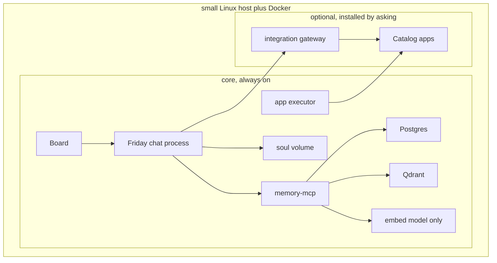

# Architecture

**Status: draft. This describes the target design, not a built system.**

The customer-facing picture of the same target, including what this
repository implements today, is [system.md](system.md).

## Two layers

| Layer | Rule |
|---|---|
| **Core** | Always installed, small RAM footprint, cannot be removed. Nothing in this repo is wired to memory or the app executor yet — this table describes the target, not the current state of the code. |
| **Optional apps** | A menu rendered from a pinned snapshot of [`truenas/apps`](https://github.com/truenas/apps) (community and stable trains only), plus a few project-specific optional pieces (Mattermost, Taskrunner, Cloudflare tunnel, Headscale). An id installs only when it is on the allowlist, has a wire, and has passed a render test. Nothing in this layer starts until the owner approves that exact operation. |

Left out of core on purpose: Mattermost, Telegram, media servers (Plex,
Jellyfin), the `*arr` stack, Home Assistant, Coder/Taskrunner, Cloudflare,
Headscale, and any chat-sized local language model. Those are optional
apps installed only after the core boots and the owner approves them one
at a time. A template that needs host networking, host PID, host IPC, or
a device or capability the reviewed manifest does not list is refused and
stays listed. The first candidates are one media player and Home
Assistant.

## Core pieces

| Piece | Role | Footprint |
|---|---|---|
| Friday | The only mouth. No host port. The Board calls it on the compose network. Reads memory through the memory service, plus core health and the app registry. | One process |
| Board | The only host page, published at `127.0.0.1:8080`. Discover, health, grants, and the ask box. Login is the Board password. | One small process |
| Qdrant | Semantic memory, cosine similarity, 768 dimensions, vectors on disk | Small while collections are empty |
| Ollama (`nomic-embed-text` only) | Turns a sentence into a vector. Chat itself never runs a local model. | The largest core piece on disk |
| memory-mcp + Postgres | The durable `memories` row, id shared with the Qdrant point. Holds the Qdrant key and applies the owner filter. Friday does not. | One small database |
| Soul volume + Friday SQLite | Character, charters, conversations, obligations | Files on disk |
| App executor | A process separate from the chat process. Accepts a named operation only when an approval record matches it exactly — never a raw shell string or an arbitrary Compose file. | One small container, no model and no page fetcher |

## The key boundary: chat never mutates infrastructure directly

Anything that changes state outside of chat — installing an app, changing a
grant, running a backup — goes through the executor, and only through a
pre-approved, exact-match operation record. A model argument such as
`confirmed=true` is never sufficient; the approval record is created by the
owner on the Board, after authenticating with the Board password, and
the chat process cannot create or exchange it itself.

An approval record stores: the operation name, the app id, the reviewed
manifest version (catalog pin, template hash, rendered digest), the image
digest, the canonical mount list, the ports, the privileges, the devices, and
the network mode. It expires after a short window and can be exchanged once.
Any change to those fields voids the record.

Exchanging an approval is one transaction: the record moves from `approved`
to `exchanged`, and an operation journal row is inserted with a new
operation id and the ordered steps to run. Every Docker object a step
creates carries a label naming that journal. Recovery after a crash checks
each journaled step for the resources and state it was supposed to leave
behind, and resumes idempotently — it never mints a second approval and
never creates a second container for a step that already succeeded.

## Network segmentation

Two Compose networks separate the trusted core from anything optional:

| Network | Carries |
|---|---|
| `core` | Friday, Board, Qdrant, Postgres, Ollama, memory-mcp, and the executor's control listener |
| `apps` | Optional apps, the webhook receiver, and an integration gateway |

The executor sits on both networks so it can health-check an app by its
Compose DNS name and container port, and so an approved operation can
reach that container directly. Friday itself is **not** on the `apps`
network. Advisors reach an app only through the gateway, which also sits
on both networks and allows only the method and path a wire file names
for that advisor. The diagram shows that split: Friday's request goes
through the gateway, and the executor's health check goes to the app.
An app container cannot open Postgres, Qdrant, or the executor's control
port; that boundary is meant to be a test, not just a design intent, but
no such test exists yet — there is no executor, gateway, or `apps` network
in this repo today.

An adopted app is called at an owner-supplied base URL. That address is
resolved before any health call or tool call. It is refused when it
points at Postgres, Qdrant, the memory service, the executor, the
gateway's core listener, any other core service name, a link-local
address, or a host metadata address.

The webhook receiver is the only process an app may call, and only with
the generated header. It stores a typed event. Friday announces that
event with a fixed sentence. The raw body is kept for the log and is not
placed in the model prompt. The receiver does not call the executor and
does not write an approval.

## Approval and mount safety rules

- The system disk is an EFI partition, two system slots, and a data
  partition. The first image target is one x86_64 disk of at least 64 GB:
  512 MB EFI, two 16 GB system slots, and a data partition that fills the
  rest, with at least 16 GB free after install.
- The data partition holds the machine id, secrets, Postgres, Qdrant,
  SQLite, the soul, the executor journal, and free space for one
  pre-upgrade backup. An upgrade refuses to start when that free space is
  smaller than the live databases.
- App mounts are canonicalized (symlinks included) and must fall under the
  app storage disk the owner names when approving that app. That disk is
  a different device from the data partition. Downloads, video files, and
  app config are refused on the data partition.
- `/`, `/etc`, the owner's home, the secrets volume, the soul volume, the
  SQLite directory, the Docker data root, and the Docker socket are always
  outside the app storage disk and are refused.
- Host network, host PID, and host IPC modes are refused.
- A device or capability not listed in the reviewed manifest is refused.
- Ports bind to `127.0.0.1` on the host unless a separate, later
  publication approval names that route explicitly.
- The image architecture must match the host, and the declared memory must
  fit measured free RAM.

## What this repo is building toward

See the repo README for the full Compose profile layout (`core`, `chat`,
`code`, `edge`, `mesh`) and the build order this project follows before any
release image is produced. This document — and the rest of `docs/` — will
be filled in with implementation detail as each build-order step lands;
right now most of it describes the target, not code that exists yet.
