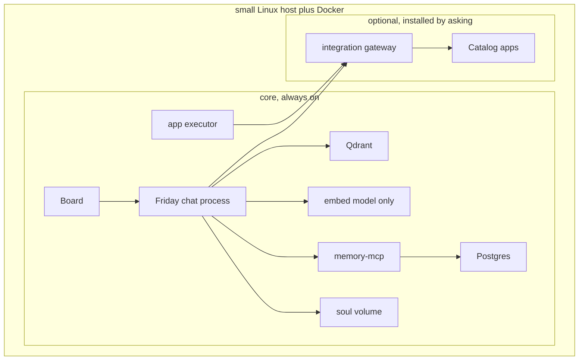

# Architecture

**Status: draft. This describes the target design, not a built system.**

## Two layers

| Layer | Rule |
|---|---|
| **Core** | Always installed, small RAM footprint, cannot be removed. Nothing in this repo is wired to memory or the app executor yet — this table describes the target, not the current state of the code. |
| **Optional apps** | The Docker Compose catalog rendered from a pinned snapshot of [`truenas/apps`](https://github.com/truenas/apps) (community and stable trains only), plus a few project-specific optional pieces (Mattermost, Taskrunner, Cloudflare tunnel, Headscale). Nothing in this layer starts until the owner asks for it. |

Left out of core on purpose: Mattermost, Telegram, media servers (Plex,
Jellyfin), the `*arr` stack, Home Assistant, Coder/Taskrunner, Cloudflare,
Headscale, and any chat-sized local language model. Those are optional,
allowlisted apps installed only after the core boots and the owner approves
them one at a time.

## Core pieces

| Piece | Role | Footprint |
|---|---|---|
| Friday | The only mouth. Console reaches every advisor; also reads memory, core health, and the app registry. | One process |
| Board | Discover screen: installed, available, health, grants | One small process |
| Qdrant | Semantic memory, cosine similarity, 768 dimensions, vectors on disk | Small while collections are empty |
| Ollama (`nomic-embed-text` only) | Turns a sentence into a vector. Chat itself never runs a local model. | The largest core piece on disk |
| memory-mcp + Postgres | The durable `memories` row, id shared with the Qdrant point | One small database |
| Soul volume + Friday SQLite | Character, charters, conversations, obligations | Files on disk |
| App executor | A process separate from the chat process. Accepts a named operation only when an approval record matches it exactly — never a raw shell string or an arbitrary Compose file. | One small container, no model and no page fetcher |

## The key boundary: chat never mutates infrastructure directly

Anything that changes state outside of chat — installing an app, changing a
grant, running a backup — goes through the executor, and only through a
pre-approved, exact-match operation record. A model argument such as
`confirmed=true` is never sufficient; the approval record is created by the
owner on the Board or in the console, after authenticating with the
dashboard token, and the chat process cannot create or exchange it itself.

An approval record stores: the operation name, the app id, the reviewed
manifest version (catalog pin, template hash, rendered digest), the image
digest, the canonical mount list, the ports, the privileges, the devices, and
the network mode. It expires after a short window and can be exchanged once.
Any change to those fields voids the record.

Exchanging an approval is one transaction: the record moves from `approved`
to `exchanged`, and an operation journal row is inserted with a new
operation id and the ordered steps to run. Every Docker object a step
creates carries a label naming that journal. Recovery after a crash checks
each journaled step for the resources and state it was supposed to leave
behind, and resumes idempotently — it never mints a second approval and
never creates a second container for a step that already succeeded.

## Network segmentation

Two Compose networks separate the trusted core from anything optional:

| Network | Carries |
|---|---|
| `core` | Friday, Board, Qdrant, Postgres, Ollama, memory-mcp, and the executor's control listener |
| `apps` | Optional apps, the webhook receiver, and an integration gateway |

The executor sits on both networks so it can health-check an app by its
Compose DNS name and container port. Friday itself is **not** on the `apps`
network. Advisors reach an app only through the same gateway process that
sits on both networks and allows only the method and path a wire file names
for that advisor — the diagram above shows Friday's request to an app
routed through that gateway, not straight to the app, and shows the
executor reaching the gateway rather than the app container directly. An
app container cannot open Postgres, Qdrant, or the executor's control
port; that boundary is meant to be a test, not just a design intent, but
no such test exists yet — there is no executor, gateway, or `apps` network
in this repo today.

## Approval and mount safety rules

- Every mount source is canonicalized (symlinks included) and must fall
  under a storage root the owner named at bootstrap.
- `/`, `/etc`, the owner's home, the secrets volume, the soul volume, the
  SQLite directory, the Docker data root, and the Docker socket are always
  outside those roots and are refused.
- Host network, host PID, and host IPC modes are refused.
- A device or capability not listed in the reviewed manifest is refused.
- Ports bind to `127.0.0.1` on the host unless a separate, later
  publication approval names that route explicitly.
- The image architecture must match the host, and the declared memory must
  fit measured free RAM.

## What this repo is building toward

See the repo README for the full Compose profile layout (`core`, `chat`,
`code`, `edge`, `mesh`) and the build order this project follows before any
release image is produced. This document — and the rest of `docs/` — will
be filled in with implementation detail as each build-order step lands;
right now most of it describes the target, not code that exists yet.
