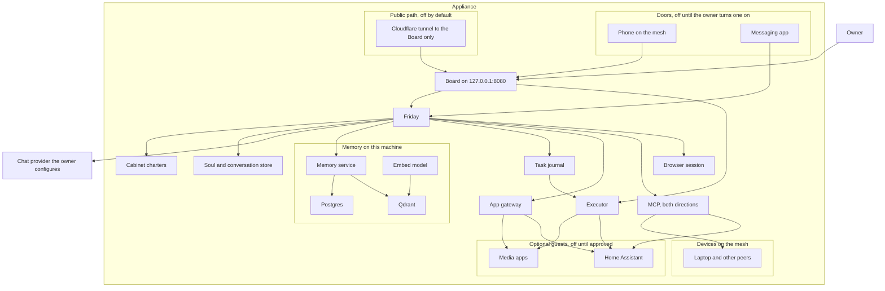
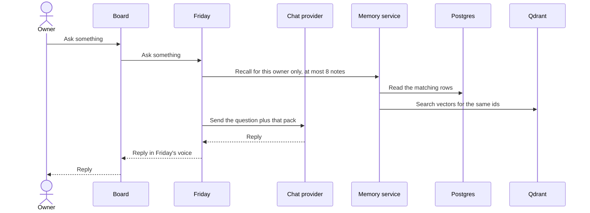
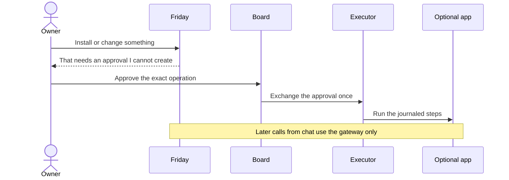
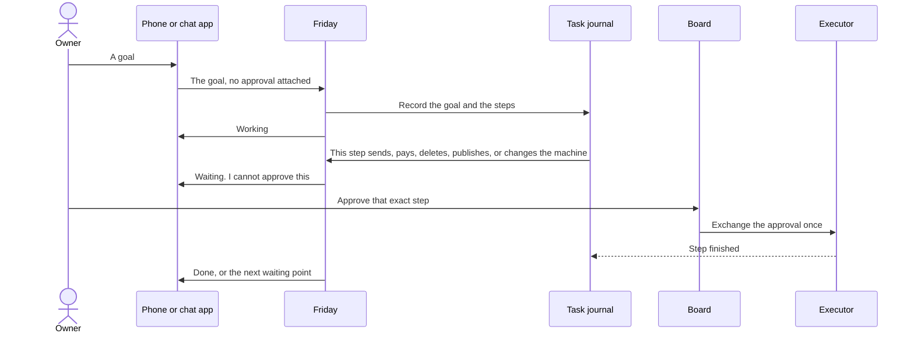

# System architecture

**Status: this is the product we are building.** v0.0.1 is a test
installer, described in [install.md](install.md). It is not this finished
system. The pictures and the sections below are the target. The last
section says what the files in this repo implement today.

Friday is the operating system. The release is a disk image for one
computer in the house. You install that image, and the computer runs
Friday. It is not an app you add to another system. Debian and Docker
are how the image is built.

The hosted products in this category are Meta Muse and Grok Bot: the
agent lives on a computer, keeps working after the chat closes, uses
the services the person has connected, and stops for a person before
mail, money, or a machine change goes out. Those products keep that
computer in the vendor's cloud. Friday keeps the computer, and the
operating system, in the house.

One assistant, Friday, talks to the owner. A few specialist roles (the
Cabinet) share that same voice and can carry a task, not only a turn.
The first release has one owner. Memory stays on the machine. A turn
still sends a short pack of recalled notes to the chat provider the
owner configured. The provider is a plug. Friday is not a model.

The owner reaches Friday from a phone and from one messaging app, and
from the Board on the machine. Other AI harnesses connect over MCP, in
both directions, and only for tools the owner has accepted. A site with
no MCP is used through a browser session on this computer. A media
player or Home Assistant can be installed later, only after an explicit
approval, and those apps cannot read the memory. They are guests.

## Why a person would run this

A hosted agent in this category already keeps working after the chat
closes, and it already asks before mail, money, or a machine change
goes out. It does that on a computer the vendor runs. Friday is for
the person who wants that job done on a computer in the house, with
the notes staying there, and with a page they can see.

The computer in that picture is the product. It is not an account on
someone else's machine. One assistant lives on it. A few specialist
roles, the Cabinet, share that same voice. The first release has one
owner.

You need it when three ordinary things are true at once.

- The work should continue after you close the chat. A goal goes into
  a task journal. Friday comes back when a step needs you. Closing the
  phone does not drop the task.
- The assistant should not be the root account. It can draft, recall,
  and use a tool you already allowed. It cannot send, pay, delete,
  publish, install, or change the machine until you approve that exact
  step on the Board.
- The memory should stay on the machine. A turn sends the model at
  most 8 notes, already trimmed, and only notes that belong to you.
  The database, the disk, and a shell are not sent with the question.

The Board is the screen of this operating system. A browser on the
machine draws it at `127.0.0.1:8080`. That address is how the screen is
shown on the box. It is not a website, and it is not a chat app beside
the OS. Open WebUI and LibreChat are not part of Friday. The model is
a plug: any OpenAI-compatible endpoint you already have. Setup does
not name a vendor.

First boot happens on a monitor attached to this computer. There is no
SSH. The page opens before a network link exists. You connect a cable
or join Wi-Fi, then you create the server. Creating the server starts
the core that already shipped in the image, on this computer. Nothing
in that core is downloaded, and the Board stays at `127.0.0.1:8080`.
You then give your name, a timezone, and the model key. Chat stays off
until that key returns a real reply and the local embedding check
returns 768 dimensions from `nomic-embed-text`. A different model is
refused, including when its vector is also 768 long.

The image already carries Friday's character and the Cabinet roles, so
it knows its job before you explain it. Your notes start empty. After
you confirm the Board password, the same page becomes the conversation
and Friday speaks first. It asks what you want set up, in ordinary
language. You answer the same way. A later app, a phone, or another
harness is something Friday can ask about then, one confirmed step at
a time. Those are not questions on the setup form.

Reach from the phone comes after that, and only when you turn it on.
The phone opens this same Board over a private mesh. It can ask and it
can approve. It does not join the network that holds the database. A
messaging app can deliver a turn and can say "waiting" or "done". It
cannot approve. A public address is off unless you later turn on a
tunnel, and that tunnel can reach only the Board.

Optional apps, such as a media player or Home Assistant, are guests.
They can be useful. They are not why the computer is there. They
cannot read the memory, and Friday is not on their network.

## The design, stated once

The rest of this page is the same design in more detail. These are the
decisions, in the order a new reader needs them.

| Decision | What it means |
|---|---|
| Friday is the OS | The release is a disk image for one computer in the house. Friday is the agent on that computer. The model is an OpenAI-compatible plug you supply. Embeddings stay local: `nomic-embed-text`, 768 dimensions. |
| The Board is the screen | The OS draws it on a monitor at `127.0.0.1:8080`, as one small Node process. Friday has no second screen and no host port. Open WebUI and LibreChat are not part of the OS. |
| First boot is on the attached monitor | Connect a cable or Wi-Fi. Create the server from the core already in the image. Then name, timezone, and the model key. Confirm the Board password. No SSH. A power loss does not mint a second set of secrets. |
| Friday speaks first | The character and the Cabinet roles ship in the image. Your notes start empty. The first message asks what to set up. A goal that should outlive the turn goes into the task journal. |
| Memory has an owner | Postgres holds the note. Qdrant holds the vector for that same id. A search without an owner is refused. A turn sends at most 8 notes. A delete removes the vector. |
| The model cannot approve itself | Send, pay, delete, publish, install, grant, backup, and any other machine change need an approval record. Only the Board creates and exchanges it. The page exchanges one life step and does not send it. Chat, a messaging door, and an outside harness cannot. `confirmed=true` is ignored. The record expires in ten minutes and works once. Catalog install is refused until a later step opens it. |
| An app event is a fixed sentence | Jellyfin posts `/media`. Radarr and Sonarr post `/arr`, with the header `Friday-Webhook`. Friday may say "A download was grabbed.", "A download failed.", "An app health state changed.", or "An app sent an event." The raw body stays in the log. |
| Later doors cannot become root | The phone opens the Board. A messaging app delivers turns. MCP runs in both directions, and unlisted tools stay out of the prompt. A site with no MCP uses a disposable browser session that cannot see the password or the card. Apps sit on their own network. |
| Two disks, two system slots | The system disk is EFI, slot A, slot B, and a data partition. Movies and app files go on a different disk. An upgrade refuses to start when the data partition no longer has room for one backup. |

What is in this repository today is the last section on this page.
v0.0.1 is a test installer you can flash. It does not boot the core.
A later local image was booted under QEMU, and its serial log printed
“The core on this computer was started. Nothing was downloaded.” That
log did not say the webhook receiver, the gateway, the catalog
snapshot, the kiosk, or Wi-Fi join were omitted. The boot had no
graphics device and no wireless adapter, so the kiosk and the Wi-Fi
join did not run. The setup screen still said the embed check was not
checked, and setup was not finished. The compressed file
is over the GitHub release limit, so v0.0.1 remains the download. A
later image packs the messaging door and the inbound MCP listener on
an internal doors network under profile reach, with no host port. A
QEMU boot of that image printed “The core on this computer was
started.” The serial capture ends on that line. It did not say those
five pieces were omitted, and it did not report that profile reach had
started. Creating the server does not start that profile. The setup
screen still said the embed check was not checked, and setup was not
finished. The boot had no graphics device and no wireless adapter. The
compressed file is still over the GitHub release limit. A later
image also packs the browser session on an internal browser network
under the same profile, with no host port. A QEMU boot of that image
printed “The core on this computer was started. Nothing was
downloaded.” It did not say those five pieces were omitted, and it
did not report that profile reach had started. The setup screen still
said the embed check was not checked, and setup was not finished. The
boot had no graphics device and no wireless adapter. The
memory bootstrap, the approval rules, and the webhook rules are in the
tree. A start in this tree records `Embed: nomic-embed-text, 768` only
when that start returns a 768-number vector from `nomic-embed-text`. A
check that returns nothing leaves the line at not checked. The boots
above did not write that flag, and this change has not been booted.

## Why it is split this way

A chat model is good at language and bad at being the root account on a
disk. If the same process that writes replies can also install software,
open a tunnel, or delete a library, a confused or hostile reply becomes
an outage. The split below is the remedy.

| Need | How it is met |
|---|---|
| One place to talk | The Board is the screen of the OS. Friday is the only voice. Advisors are roles of that process, switched for a turn (`@cto`, "ask my cfo"), or kept until "back to Friday" when the owner says "talk to my" or "stay with". A reply from that role starts with the charter's name. The stay is in the process, not a note. Installing an app does not create another person to talk to. |
| Answers that remember | Postgres holds the note. Qdrant holds the vector used to find it later. Both carry the same id, and both carry an owner. A turn sends at most 8 of those notes to the chat provider. That pack is the part that leaves the machine. |
| What the model is shown stays evidence | A tool result in the prompt is evidence. `friday/ask.py` does not save it and does not treat it as the goal. A note is saved when the owner asks to remember. A webhook is stored as a typed event and announced with a fixed sentence. The raw body is not pasted into the prompt as instructions. |
| Notes that do not leak between people or roles | A person and a role never share a namespace. A search without an owner filter is refused, including `knowledge` and findings, and including while there is only one owner. Reflection, export, and an advisor lookup of someone else return nothing from the other person's notes. A second person is not shipped. A shared household pool is not created. |
| The model cannot install software by saying so | An install, a grant change, a backup, a send, a payment, a delete, or a publication is a named operation. The owner approves that exact record on the Board. Chat cannot create or exchange the record. A model argument such as `confirmed=true` is ignored. |
| A goal outlives the chat | The task journal holds the goal, the steps, and whether Friday is waiting on the owner. The Board lists that owner's goals and does not start them. A credential-shaped goal is left off the list. Closing the phone does not drop the task. Friday resumes the same journal after a crash and does not mint a second approval. |
| Reach it from anywhere | The phone opens the Board over the private mesh, so ask and approve both work away from the machine. A messaging app delivers turns and status, and it cannot approve. A public tunnel is optional, off by default, and can only reach the Board. |
| Other harnesses, and the rest of the web | MCP is the bus. Friday calls a granted server, and a granted harness can call Friday. Tools the owner has not accepted are not shown to the model. A site with no MCP is opened in a browser session on this computer. The session is not a shell on the host. |
| Your devices stay peers | The phone, the laptop, and the box join the mesh as machines the owner meant to keep. A peer may expose an MCP endpoint. Friday does not mount that peer's disks, a USB device, or the Docker socket. |
| Optional apps stay guests | Apps sit on their own network. Friday is not on that network. An advisor reaches an app only through a gateway that allows the method and path named in that app's wire file. An app cannot open Postgres, Qdrant, or the executor's control port. An adopted app's address is refused when it resolves to any of those. |
| The machine is not on the internet by default | The Board is the only page on the host, at `127.0.0.1:8080`. Friday has no host port. No door is on until the owner turns it on. Memory, Postgres, and the download apps are never given a public name. After qBittorrent is installed, its swarm traffic still reaches the public internet. Only its settings page stays on localhost. |
| Chat works before anything else depends on it | The appliance does not ship a chat-sized model. The owner points it at an OpenAI-compatible base URL (a hosted provider, or a server they already run) and names a fast model and, if they want, a separate think model. That URL is the model. The screen stays the Board. Setup does not continue until that endpoint returns a real reply. Memory embeddings are separate and local: `nomic-embed-text`, 768 dimensions. |

## The systems

Postgres is the authority for a memory. Qdrant is the search index for
that same id. The embed model only turns text into a vector. Friday does
not hold the Qdrant key. Search and writes go through the memory service,
which applies the owner filter. The owner talks to the Board, on the
machine or from a phone that has joined the mesh. A messaging app talks
to Friday and cannot open the approval path. The Board calls Friday on
the internal network.

The chat provider is outside the appliance. Friday calls it with the
question and the recall pack. It never receives the database, the disk,
or a shell.

## The screen of the OS

The Board is that screen. One small Node process draws it at
`127.0.0.1:8080` and calls Friday at `http://friday:8080` on the
Compose network. Friday has no second screen and no host port.

Open WebUI and LibreChat are not part of the OS. The OpenAI-compatible
base URL is the model, not the screen. Setup names no vendor. `board/`
is that Node process. Compose builds it and publishes `127.0.0.1:8080`.
The v0.0.1 image serves a text console and a Python page on
`127.0.0.1:8080`. That page is not this Board, and v0.0.1 does not
contain this process.

A messaging app delivers turns and cannot approve. `doors/server.py` is that process. It stays off until the owner sets `DOOR_ENABLED=yes` and starts profile `reach`. `doors/token.py` records one generated secret for that adapter and returns the name `DOOR_TOKEN` only. The value stays in the process. Recording it does not start the door. The server still reads the environment and does not call that record.
First boot's setup screen is the Board's `/provision` path. It connects
a cable or Wi-Fi, creates the server on this computer, and takes the
model key. When that key returns a real reply, the same page is the
conversation, and Friday speaks first. The sequence is under
[First boot](#first-boot).

The executor is the process that will create or change containers. The
one in this tree records the approval. A caller-supplied runtime creates
the container step and does not call the host Docker daemon. Applied is
recorded only when that runtime says the container is up. A second
resume does not create it again. Without a runtime it does not start a
container, send mail, or pay. It reaches an app directly in the target
design so it can health-check it and so an approved operation can run.
Friday's
later questions ("is the movie downloaded?")
go through the gateway, not through that control path. A question for
another harness goes through MCP. A site with no MCP is opened in the
browser session. Neither path can skip the approval record.

## What a question does

A turn addressed to an advisor uses that role's charter and that role's
owner id. It does not open another person's notes. "ask my" and `@`
last for that turn. "talk to my" and "stay with" a name keep the charter
until "back to Friday". "stay with that advisor" keeps the charter from
the latest one-turn address. A one-turn address does not replace that stay.
`friday/hat.py` holds the stay in the process. A restart returns to
Friday. The stay is not a note and does not write an episode. A spoken model turn writes one episode for that owner, the owner's words and the reply. A credential-shaped turn is not stored, including a percent-encoded or plus-encoded copy. A remember and a waiting turn do not write one. The Board gives each of those six an ask box. The chief's box posts to the same Friday. A credential-shaped question is not sent, and the box does not start a job. A reply
from that charter starts with the charter's name. The provider is sent
the question plus a bounded pack: at most 8 notes, each already trimmed
to a few hundred words, filtered to this owner. A tool result the caller
supplies is evidence in that same prompt. It is not the goal, it is not
saved, and the words inside it do not become the action. At most 8
results are accepted, each trimmed to 1200 characters. A credential-shaped
result is refused and is not shown, including a percent-encoded or plus-encoded copy. The Board ask box and the messaging
door do not forward one. The request names the
owner's fast model. `friday/model.py` posts that name. The optional
think model is posted only when `think` is exactly true and that name
is set. An empty think name leaves the turn on the fast model. A missing
fast name is refused. A credential-shaped name is not posted. Setup
refuses that name and does not store it. No model id is baked in. The words of the question do not switch the model. `knowledge` and findings
are included only through that same filter. `memoryd/hub.py` queries only
those two collections for that owner. A missing filter is refused before
any query. It does not create a collection, it does not write a point.
Friday's /ask calls POST /hub for that owner and adds those notes to the
same pack of at most 8. A hub that is not ready leaves the note pack
unchanged. This check was not run against a live Qdrant. `memoryd/persona.py` copies that owner's newest 8 profile
notes into one persona note. An ordinary remember is not copied. A
credential-shaped line is left out, including a percent-encoded or
plus-encoded copy. When every line in that window is a credential,
nothing is written. A portrait question returns at most 8 persona notes,
each trimmed to 1200 characters. A credential-shaped note id is not shown,
including a percent-encoded or plus-encoded copy. An empty id is not shown.
Chat cannot extract or read them. The
Postgres client refuses that category and does not connect. HTTP `/save`
does not write it. No collection is created. Friday's ask path does not
call it. This check was not run against a live Postgres. `memoryd/card.py`
records one research card or one kept decision for that owner. Without
`POSTGRES_HOST` the row stays on the file store. The card is category finding. The decision is category
knowledge. A raw page is not stored, including a percent-encoded or
plus-encoded copy and a copy rebuilt by that removal. A credential-shaped summary is not stored. Chat
cannot record one. With `POSTGRES_HOST` set, `POST /card` writes that
row through `memory_save`. A second card of the same text revises that
one row. HTTP `/save` still refuses those categories and does not
connect. No collection is
created. A separate topic label is not stored. Friday's ask path does
not call it. A tool result is still not saved. This check was not run
against a live Postgres. Saving a note writes the
Postgres row and an indexing-queue item in one transaction, then updates
Qdrant. A delete removes the vector. It does not leave a searchable copy
behind. A one-character edit is a new row, because the live identity
includes a hash of the content. The pack cap is what keeps that growth
from being sent out in full.

## What a change to the machine does

The approval names the operation, the app, the reviewed manifest, the
image digest, the mounts, the ports, the privileges, and the network
mode. It expires after ten minutes and can be used once. Any change to those
fields voids it. App mounts have to fall under the app storage disk the
owner names in that approval. That disk is a different device from the
data partition. The data partition holds the machine id, secrets,
Postgres, Qdrant, SQLite, the soul, the executor journal, and free space
for one pre-upgrade backup. Downloads, video files, and app config are
refused there. An upgrade refuses to start when the data partition no
longer has room for that backup. The host root, `/etc`, home
directories, secrets, the soul files, the database files, and the Docker
socket are refused. Ports bind to `127.0.0.1` unless a later publication
approval says otherwise.

The first image target is one x86_64 disk of at least 64 GB: a 512 MB
EFI partition, two 16 GB system slots, and a data partition that fills
the rest, with at least 16 GB free after install so the backup fits. A
movie library does not fit in that remainder.

## What a task does

A task is a goal that continues after the reply. "Book Tuesday and tell
me when it needs a card" is a task. "Install Jellyfin" is a machine
change, and it uses the same journal shape. The journal stores the
owner, the role, the goal, the ordered steps, and the state: ready,
running, waiting, done, or blocked.

Drafting, recalling, and reading a tool the owner already granted do not
need a new approval. Sending, paying, deleting, publishing, installing,
changing a grant, and backing up do. The chat process, the messaging
door, and an outside harness cannot create or exchange that record. A
crash resumes the same journal. It does not start a second copy of a
step that already succeeded.

Friday reports waiting and finished tasks on the door the owner used.
The raw page, webhook, or tool body is still evidence. It is not written
into the journal as instructions. `gate/journal.py` records a running
or blocked step on that journal. A tool noticed while the task is
running stays off until the Board accepts that name. Accepting one name
does not accept another. A page, webhook, or tool body stays evidence
and does not replace the goal. The door is told one word: working,
waiting, or done. A sensitive step stays waiting until an approval for
that step and that same owner is already exchanged. A different owner's
approval does not finish it. A different case of that step name still
waits. A credential-shaped owner or role is not stored. This module
does not create that approval, and Friday's ask path does not call it.
The Board lists that owner's goals from the executor. A credential-shaped
goal is left off the list. Listing them does not start a task.

## Doors and devices

| Door | What it can do | What it cannot do |
|---|---|---|
| Board on the machine, `127.0.0.1:8080` | Ask, see health, list this owner's task journal, accept a grant, approve. This is the screen of the OS | It is the only approval screen. Listing a goal does not start it |
| Phone on the mesh | Open that same Board | Skip the Board password. Join the core network |
| Messaging app | Deliver a turn, and carry "waiting" or "done" back | Create or exchange an approval. Read Postgres |
| Public tunnel | Reach the Board, only after a verified access check, and only if the owner turns it on | Reach Friday's container, memory, Postgres, or Qdrant |

The mesh is how the phone, the laptop, and the box are one private
network. Each long-lived machine is a peer the owner pre-authorizes. A
peer may expose an MCP endpoint, and that endpoint is a grant like any
other. Friday does not mount the peer's disk. An ephemeral code machine
is not one of these peers, and removing it must not remove the phone or
the laptop. `remove_node` in `doors/reach.py` records that rule. While
Headscale is absent the ephemeral name is skipped. A phone, a laptop,
and a NAS are refused. Failed coder work is kept for three hours. The
function does not open a socket. `doors/peers.py` records one pre-auth key for a phone or a laptop and returns the name only. A caller-supplied value is not stored. Phone and laptop do not share a key, and the key is not reused for a coder machine. An MCP endpoint on that peer is a grant. A filesystem, a USB device, host networking, or the Docker socket is refused. The module does not call Headscale and does not open a socket. Setup can leave the Board on this computer, join an existing Headscale, or run Headscale here. The mesh stays quiet until that choice.

No door is on at first boot. The setup screen is the local keyboard and
monitor. Reach-from-anywhere is turned on afterward, one door at a time.

## MCP

MCP is how Friday talks to other agent harnesses, and how those
harnesses talk to Friday. A catalog wire is the same idea for an app
that is not an MCP server: a named method and path, for one role, off
until accepted.

| Direction | Rule |
|---|---|
| Friday calls out | The server URL, the secret reference, the role, and the tool names are a grant. Tools the grant does not name are not put in the model prompt, even if the server offers them. `mcpbus/ref.py` records one generated secret and returns the name `MCP_SECRET_REF` only. A caller-supplied value is not stored. Chat cannot record one. The value stays in the process. It is not the notify token, the messaging-door token, or the inbound MCP token. Recording it does not call the server and does not create an approval. `mcpbus/outbound.py` still reads the environment and does not call that record. Friday's ask path does not call it. |
| A harness calls Friday | It presents its own token. Recall uses the same owner filter and the same cap of 8 notes. A call that would send, pay, delete, publish, or change the machine becomes a waiting approval. It does not run. `mcpbus/token.py` records one generated secret and returns the name `MCP_TOKEN` only. A caller-supplied value is not stored. Chat cannot record one. The value stays in the process. It is not the notify token and it is not the messaging-door token. Recording it does not start the listener and does not create an approval. The server still reads the environment and does not call that record. |
| Memory | The caller does not receive the Qdrant key, the database, or a shell. |

A laptop on the mesh reaches Friday's MCP listener. It does not join
the Docker network that holds Postgres. The listener is authenticated.
An accepted tool that later appears under a new name stays off until
the owner accepts the new name. A catalog upgrade follows the same rule.
`guests/upgrade.py` records that ask for one known managed app. The
image is not upgraded. A new tool stays off until the Board accepts
that name. Applying it returns `catalog_install_closed`. Friday's ask
path does not call it.

## Browser session

Most sites have no MCP server and no API. The browser session is how
Friday uses them. It is a disposable browser on this computer, with no
host mount, no host network, and no Docker socket. It is not on the
core network, so a page cannot open Postgres, Qdrant, the memory
service, or the executor.

Credentials for a site stay in the vault. The session receives them
from a broker for that site. The model sees the page as evidence. It
does not see the password or the card. `browser/broker.py` records one generated secret for one site and returns the name `SITE_CREDENTIAL` only. A caller-supplied value is not stored. Chat cannot record one, and that refusal leaves a secret already recorded. The value stays in the process. It is not placed on the environment. It is not the notify token, the messaging-door token, or the inbound MCP token. The model is not given the value. A core name, a loopback address, including an abbreviated spelling, and a link-local address are refused. Recording it does not fetch a page, does not start a browser, and does not create an approval. The server still reads the environment and does not call that record. Friday's ask path does not call it. Sending, paying, deleting, and
publishing from the session are waiting steps. They use the same
approval record as an install. Reading and drafting do not.
`browser/server.py` is that fetch. It stays off until the owner sets
`BROWSER_ENABLED=yes`. The secret is sent only to the named site and
is removed from the page text. `browser/session.py` records one page
as evidence, "A page was read.", and does not keep the vault secret.
The raw page is not the goal. The Board discards that session when the
owner stops it. The executor discards it when the task finishes. Chat
cannot, and that refusal leaves the page. A different case of that
reason leaves the page. It does not fetch, does not start a browser,
and does not create an approval. Friday's ask path does not call it.
The server still does not call that record. The image compose file lists it on an
internal browser network under profile reach, with no host port.
Creating the server does not start that profile.
`scripts/prove-browser.sh` checks that on throwaway networks. A later QEMU boot of the image that lists it printed “The core on this computer was started. Nothing was downloaded.” It did not report that profile reach had started. The setup screen still said the embed check was not checked, and setup was not finished.

## First boot

The finished first boot is one owner, at the machine, with a monitor and a
keyboard. A full-screen browser on that screen is the only setup door.
v0.0.1 has the text console and the local page, and it does not have the
browser. The steps below are the target. In v0.0.1, "create the server"
records the confirmation and does not start anything, Wi-Fi is stored and
not joined, and setup cannot finish because the embed model is absent.
There is no SSH. The machine mints its id and its secrets before it asks
anything, and stores them on the data partition.

The browser can open the setup page only with a provisioning token the
launcher created for that local user. The kiosk launcher adds that
header, and only when the path is `/provision`. The token is not a
chromium argument and not a field on the form. The page is a form for
the cable, Wi-Fi, creating the server, the name, the timezone, the
model, and the saved-password confirmation. Install stays closed. The
page opens on that screen before any network link exists. Every other
path on port 8080 already requires the Board password. This launcher
was not booted.

The page then walks through these steps. A power loss returns to the
same step and the same Board password. It does not mint a second set.

1. Connect this computer. Use the cable when a wired link is already up,
   or choose a Wi-Fi network and enter its password. The page shows the
   link. A later boot reuses a saved link. The Wi-Fi password stays on
   the data partition and is not shown again.
2. Create the server. The owner confirms, and the page starts the core
   that shipped in the image: Friday, the Board, memory, and the embed
   model. This computer is the server. Those pieces are not downloaded.
   The Board stays at `127.0.0.1:8080`. No port is opened on the local
   network, and no tunnel or mesh is started.
3. Name, timezone, and the model key: an OpenAI-compatible base URL, an
   API key, a fast model, and an optional think model. Setup names no
   vendor. A credential-shaped fast or think name is refused and is not
   stored. Chat stays off until that endpoint returns a real, non-empty
   reply. The local embed check must return a 768-dimension vector from
   the pinned model, `nomic-embed-text`. The check reads the model id in
   the reply. A missing id, or any other id, is refused, including when
   the vector is 768 long. A stored yes does not skip the check. Finish
   reads the reply again. That decision was not run against a live
   Ollama. Changing the pin is a new image.
4. The owner confirms they have saved the Board password. The launcher
   then deletes the provisioning token and `/provision` returns 404.

The image already carries Friday's character and the Cabinet roles, so
the model knows its job before the owner explains it. The owner's notes
start empty. The same Board then opens the conversation, and Friday
speaks first: it asks what the owner wants set up, in ordinary language.
A goal that should outlive the turn goes into the task journal. Sending,
paying, deleting, publishing, installing, and changing the machine wait
on that page until the owner approves the exact step. The model does not
finish those steps on its own.

The setup page cannot install a catalog app, change a grant, or read
owner memory. A messaging door, the mesh, MCP grants, the browser
session, apps, a second person, and a tunnel are not questions on this
screen. Friday can ask about them in the conversation afterward, one
confirmed operation at a time.

If the Board password is lost after setup, the owner opens a recovery
prompt from the local keyboard. That prompt is not reachable over the
network. It replaces the Board password and leaves memory and the other
secrets in place. The exact sequence is in [secrets.md](secrets.md).

## Capabilities

| Capability | Systems involved | Why it is a separate piece |
|---|---|---|
| Talk, and hand a goal to a role | Friday, Cabinet charters, task journal, soul file | The role is a job description, not an account and not a second memory. The journal is what keeps the goal after the turn ends. After the model key works, Friday speaks first on the Board and asks what to set up. |
| Remember and find a note | Memory service, Postgres, Qdrant, embed model | The text and the vector can be updated and deleted together. Search without an owner is refused. The provider receives at most 8 notes. An MCP caller gets the same filter and the same cap. |
| Approve a send, a payment, a delete, a publication, or a machine change | Board, task journal, executor | The Board is the only approval screen. The phone can open it over the mesh. Chat cannot. |
| Use another AI harness | MCP grants | Both directions. Unaccepted tools stay off. |
| Use a site that has no harness | Browser session, vault | The session is disposable and off the core network. The model does not see the credential. |
| See what is installed, healthy, or waiting | Board | Discovery and approval stay on a screen the model cannot click for you. |
| Install a media player or Home Assistant | Board, executor, allowlisted wire, app storage disk | Optional guests. Discover can list the pinned catalog. An id installs only after a render test and an approval. The media library is a separate disk. |
| Reach the Board from a network you do not control | Cloudflare tunnel, off by default | A tunnel is a path to the Board, not a login, and not the way devices join. The mesh is that way. |
| Choose the chat model | Owner-set base URL, API key, fast model, optional think model | The rest of the appliance assumes chat works. Setup checks that with a real reply before continuing. An ordinary turn posts the fast name. The think name is posted only when think is exactly true and that name is set. A credential-shaped name is refused and is not stored. No model id is baked in. |

Starter roles on the first image are chief, cto, cfo, coach, home, and
media. `cabinet/configure.py` lists those six at job cap 0. The Board
page lists those six at job cap 0 and shows a stored secret by name only. It records claude-code or gsd, a budget of 5 to 180 minutes, a durable home named agent-<role>, and the collection cabinet_working. Job cap stays 0. The home is not created. It does not start taskrunner. It shows an update as not applied. No key is configured. `memoryd/soul.py` records a proposal for `SOUL.md` or `CHAPTER.md` and does not write the example. The Board page records one proposal and applies it only when the presented token matches. The token is not stored. A week flag does not apply it by itself. The file is not written. Chat cannot record or apply one. Friday's ask path does not call it. A role can carry a task under its own owner id. A larger set
ships inactive under `charters/full/`. `cabinet/enable.py` records one of
those names. The only target kept is the relative link `full/<id>.md`.
The file is not copied and the link is not created. Family stays blocked.
An absolute path is refused. A mount pointed at the full pack is refused.
Chat cannot record one, and that refusal leaves a link already recorded.
A credential-shaped name is not stored, including a percent-encoded or
plus-encoded copy. The Board page lists those inactive names and records one relative link. It does not call that module. The file is not copied and job cap stays 0. Friday's ask path does not call it.
The home and media roles do nothing useful until the
matching app is installed and its tools are granted. The family role
does nothing until a second person exists and a shared collection has
been created on purpose.

## How it is implemented

Compose profiles are the packaging. `core` is always on: Qdrant, the
embed model, Postgres, the memory service. `chat` adds Friday and the
Board. `code` and `edge` are later profiles (task runner, tunnel) and are empty in this repository. Profile `mesh` is the client and profile `mesh-server` is Headscale, both in the image compose file, both quiet until setup chooses.

The messaging door and the inbound MCP listener are in the image compose
file under profile `reach`. Creating the server does not start that
profile. Setup can leave the Board on this computer, join an existing Headscale, or run Headscale here. The mesh stays quiet until that choice. The browser session is listed under profile reach. `doors/reach.py`,
`doors/token.py`, `mcpbus/grants.py`, `mcpbus/token.py`, `browser/session.py`, and `browser/broker.py` record
the decisions. `doors/token.py` returns the name `DOOR_TOKEN` only and
does not start the listener. `mcpbus/token.py` returns the name `MCP_TOKEN` only and
does not start the listener. `mcpbus/ref.py` returns the name `MCP_SECRET_REF` only and does not call a granted server.
`doors/server.py` and `mcpbus/server.py` listen only when the owner
turns that profile on and sets the enable flag.

Catalog apps are not written here, and they are not required for the
agent to be useful. A pin records the upstream commit of the Compose
catalog they render from. That pin is a menu of guests. A wire file is
one kind of grant: storage on the app disk, a loopback port, a health
URL, the advisor who receives the tools, and the secret names. An MCP
server the owner adds is the other kind of grant. An id installs only
when it is on the allowlist and a render test has passed. The media
bundle installs either Jellyfin or Plex, plus the download tools,
against one shared library on the app disk. Home Assistant is a
separate entry. `guests/home.py` records that plan, names the home
role's tools, and does not apply it. `catalog/render.py` judges a
description the caller supplies. It does not render a template, does
not read the draft wires, and does not write the pin. A description
that passes is recorded and not installed. `catalog/propose.py` records one draft an advisor supplies. Tools stay off until the Board accepts that name. It does not read the draft wires and does not install. The Board shows caller-supplied free RAM before either
approval is offered, and the install is refused when the declared
memory does not fit. When that declared memory is above the caller's
free RAM, `measure/ram.py` names one other guest that would free enough,
or says the machine is too small. A core flag other than false keeps
that guest off the list. A credential-shaped name is not repeated. It
does not stop that guest and does not pull an image. The Board page
shows those supplied numbers before an install button is offered. It
does not stop that guest and it does not pull. Catalog install stays
closed. Friday's ask path does not call it.

Docker networks keep the pieces apart. Only `core` exists in the dev
`compose.yml`. `image/assets/core-compose.yml` also has an internal
`apps` network, an internal `doors` network, and an internal `browser`
network. `core` carries Friday,
the Board, Qdrant, Postgres, the embed model, the memory service, and
the executor's control port. `apps` carries optional apps, a webhook
receiver, and the gateway. `doors` carries the messaging door and the
inbound MCP listener when profile `reach` is started. Friday is on
`core` and on `doors`, so a turn can reach `/ask`. The browser session
sits on its own network in the target, with a path to the public
internet and no path to `core`. The image compose file lists that
internal network under profile reach. Creating the server does not
start that profile. The dev `compose.yml` does not list it.
The executor sits on `core` and `apps`, because it has to health-check
an app by its Compose DNS name. `scripts/prove-isolation.sh` starts Postgres on a
throwaway bridge and an app container on a throwaway internal network.
The app cannot resolve the Postgres name and cannot open port 5432. A
container on the Postgres network can. A container attached to both
networks can. The app side is internal because, on the Docker that ran
the proof, a second ordinary bridge still forwarded the address.
`webhooks/receiver.py` stores a typed event and does not call the
executor. With `POSTGRES_HOST` set it calls `webhook_store`. Without
that host the event stays in memory. `sql/webhooks.sql` is the table.
The image compose attaches the receiver to `apps` and to `core` and
publishes no host port. It does not proxy. The dev `compose.yml` does
not start it. The image compose sets the executor and the
gateway to listen on the address facing Postgres (`BIND_HOST: core`).
`scripts/prove-reach.sh` checks that on throwaway networks: an app
leaves the executor, the gateway, Postgres, and Qdrant closed, a core
container reads Jellyfin's health through the gateway, and the webhook
replies are the fixed sentences. That check ran on the build machine.
The starter asks both health URLs on the core network before it
reports the core started. A QEMU boot of this image printed “The core
on this computer was started. Nothing was downloaded.” and did not
report a listener failure. The setup screen still said the embed check
was not checked. A later QEMU boot of the image that lists the
messaging door and the inbound MCP listener printed the same start
sentence. The serial capture ends at “The core on this computer was
started.” It did not report that profile reach had started. Creating
the server does not start that profile. A later QEMU boot of the image
that also lists the browser session printed “The core on this computer
was started. Nothing was downloaded.” It did not report that profile
reach had started. The setup screen still said the embed check was not
checked, and setup was not finished. A mesh peer reaches the Board and the MCP listener
through an authenticated front. It does not join `core`. Friday has no
published host port. Compose publishes only the Board, at
`127.0.0.1:8080`.

## What this repository contains today

| Piece | In the tree now |
|---|---|
| Product rules and this diagram | Written. Target, not a running system. |
| Cabinet charters and an example soul | Written. Generic. No household facts. `cabinet/configure.py` lists the six starter advisors at job cap 0. A charter tool is on only after the Board accepts that name. A tool the charter does not name is shown and stays off until the Board accepts that name. A secret slot returns the name only. A raised cap does not start taskrunner. The Board page lists those six at job cap 0. Each has an ask box on that page. The chief's box calls the same Friday. A credential-shaped question is not sent. A stored secret is shown by name only, and the page does not start taskrunner. The same page records claude-code or gsd, a budget of 5 to 180 minutes, a durable home named agent-<role>, and the collection cabinet_working. Job cap stays 0. The home is not created. Another collection is refused. `memoryd/soul.py` records a proposal for `SOUL.md` or `CHAPTER.md` and does not write the example. The Board page records one proposal and applies it only when the presented token matches. The token is not stored. A week flag does not apply it by itself. The file is not written. Chat cannot record or apply one. Friday's ask path does not call it. `friday/hat.py` keeps one charter for later turns when the owner says talk to or stay with a name, until back to Friday. "stay with that advisor" keeps the charter from the latest one-turn address. An ask or an `@` mention does not replace that stay. A reply from the role starts with the charter's name. The stay is in the process, not a note, and a restart returns to Friday. `cabinet/enable.py` records one inactive charter the Board names. The only target kept is the relative link `full/<id>.md`. The file is not copied and the link is not created. Family stays blocked. A credential-shaped name is not stored, including a percent-encoded or plus-encoded copy. Chat cannot record one. The Board page lists those inactive names and records one relative link. It does not call that module. The file is not copied and job cap stays 0. Friday's ask path does not call it. `friday/state.py` records a conversation, one obligation thread per name, reminders, and deliveries in the process and does not open SQLite. `friday/durable.py` writes that book to the file named by `FRIDAY_STATE`. The image sets `/data/friday.sqlite` on the friday volume. A new open sees the rows. Without the path, a restart drops the book. A delivery is not sent. A coder-job mirror records `tr-<task>` and does not start taskrunner. Chat cannot delete a turn, close an obligation, or send. The ask module does not call either file. The Friday process records a spoken or waiting turn when the path is set. |
| Memory rules and `sql/memories.sql` | Written. `scripts/bootstrap-memory.sh` creates the six collections, checks the 768-dimension embed, and applies the SQL. `image/qdrant_bootstrap.py` requests keyword indexes on `owner_id`, `owner_kind`, `topic`, and `source`. An existing collection is left in place, including its points, and a missing index is still requested. There is no `member_key` or `agent_id` index. It then writes one smoke point titled bootstrap ok, searches that id, and deletes only that id. The setup screen says Notes: empty only when all six counts are zero after the delete, and Notes: kept when a count is not zero. A miss does not say empty. It does not write Postgres. That round trip was not run against a live Qdrant. `memoryd/` calls `memory_save` when `POSTGRES_HOST` is set, and the index worker upserts or deletes the Qdrant point. A tombstone or a newer revision seen after the embed is not upserted. A point this claim just wrote is removed only when its payload revision is still that claim, in one filtered delete. A role is stored in `cabinet_working`. A turn addressed to an advisor recalls and saves as that role, not as the person and not as anyone else. Without that host, notes stay in a JSON file. `scripts/prove-memory.sh` uses a 768-number stub in place of Ollama. `scripts/prove-embed.sh` pulls `nomic-embed-text` into a throwaway Ollama and the memory client receives 768 numbers. That model is not in v0.0.1. A credential-shaped save is refused and nothing is written. `qdrant_store` is refused. `memoryd/isolate.py` reflects and exports one owner. Another person, or a role asking for a person, gets nothing back, and reflection writes nothing. It does not create a collection. The fold reads the newest 8 episode rows. A credential-shaped episode is left out. A spoken turn writes one episode for that owner, the owner's words and the reply. A credential-shaped turn is left out, including a percent-encoded or plus-encoded copy. A stay, a remember, and a waiting turn do not write one. Ordinary remembers stay category note, so reflection still has nothing to fold when those are the only rows. `memoryd/hub.py` searches only `knowledge` and `friday_findings` for that owner. A missing filter is refused before any query. Another owner is not searched. At most 8 notes come back, each trimmed to 1200 characters. A credential-shaped query, owner, or topic is refused and is not shown, including a percent-encoded or plus-encoded copy. A stored note whose content or topic is credential-shaped is not shown. It does not create a collection and it does not write a point. Friday's /ask calls POST /hub for that owner and adds those notes to the same pack of at most 8. A hub that is not ready leaves the note pack unchanged. This check was not run against a live Qdrant. `memoryd/persona.py` copies that owner's newest 8 profile notes into one persona note. An ordinary remember is not copied. A credential-shaped line is left out, including a percent-encoded or plus-encoded copy. When every line in that window is a credential, nothing is written. A portrait question returns at most 8 persona notes, each trimmed to 1200 characters. A credential-shaped note id is not shown, including a percent-encoded or plus-encoded copy. An empty id is not shown. Chat cannot extract or read them. The Postgres client refuses that category and does not connect. HTTP /save does not write it. No collection is created. Friday's ask path does not call it. This check was not run against a live Postgres. `memoryd/card.py` records one research card or one kept decision for that owner. Without POSTGRES_HOST the row stays on the file store. The card is category finding. The decision is category knowledge. A raw page is not stored, including a percent-encoded or plus-encoded copy and a copy rebuilt by that removal. A credential-shaped summary is not stored. `token=abcd` and "password is hunter22" are not stored. "The password is kept outside the machine" can be stored. Chat cannot record one. With POSTGRES_HOST set, POST /card writes that row through memory_save. A second card of the same text revises that one row. HTTP /save still refuses those categories and does not connect. No collection is created. A separate topic label is not stored. Friday's ask path does not call it. A tool result is still not saved. This check was not run against a live Postgres. `memoryd/promote.py` copies one working note into a second row. The working row stays. Chat cannot promote, and Friday's ask path does not call it. With `POSTGRES_HOST` set, `POST /promote` writes that copy through `memory_save` and keeps the working row's id in `promoted_from`. A promoted save with no pointer is refused and does not connect. No collection is created. This check was not run against a live Postgres. `memoryd/soul.py` records one proposal for `SOUL.md` or `CHAPTER.md`. The Board applies it only when the presented token matches. The token is not stored. A week flag does not apply it. The example file is not read or written. Chat cannot record or apply, and Friday's ask path does not call it. No collection is created. This check was not run against a live Postgres. |
| Compose file | Qdrant, Ollama, and Postgres are upstream images. Friday, the Board, memory-mcp, and the executor build from this tree as local tags. They are not in a registry and they are not in the v0.0.1 image. Compose publishes the Board at `127.0.0.1:8080` and publishes no port for Friday. Empty tokens make the four processes exit. An ordinary turn posts the owner's fast model name. The think name is posted only when think is exactly true and that name is set. A missing fast name is refused. A credential-shaped name is refused and is not stored. No model id is baked in. |
| App wires | Drafts. `catalog/discover.py` reads the `id:` lines and does not install them. The git pin is empty, so that module lists nothing. The Board lists app directory names from the packed snapshot when `CATALOG_ROOT` is set, and it does not read file text. Install stays closed. `catalog/allowlist.py` allowlists jellyfin on one Board fire and leaves every other catalog id closed. Install of an id that is not allowlisted stays closed, and install of jellyfin stays closed too. It does not store a sentence. Chat cannot fire it. Friday's ask path does not call it. `catalog/render.py` judges a description the caller supplies. It does not read the draft wires, does not render a template, and does not write the pin. A description that passes is recorded and not installed. `catalog/propose.py` records one draft an advisor supplies. Tools stay off until the Board accepts that name. It does not read the draft wires and does not install. |
| Approval gate and task journal | `gate/` decides, and `sql/approvals.sql` stores the record. Chat cannot create or exchange an approval. The Board page exchanges one life step and does not send it. A machine change is not exchanged from that button. Catalog install is refused. A journal resume does not mint a second approval. `gate/recover.py` compares that journal with objects the caller supplies. A caller-supplied runtime creates the container step. Applied is recorded only when that runtime says the container is up. A second resume does not create it again. It does not inspect Docker and does not call the host Docker daemon. Without a runtime it does not create a container. A labeled network and volume, without a running container, is not applied. A container that is already stopped is not stopped again. `gate/journal.py` records a running or blocked task step. A tool noticed while the task is running stays off until the Board accepts that name. A page, webhook, or tool body is evidence and is not the goal. The door is told working, waiting, or done. A sensitive step stays waiting until an approval for that step and that same owner is already exchanged. A different case of that name still waits. It does not create an approval. Friday's ask path does not call it. With POSTGRES_HOST set, POST /approvals and POST /exchange call approval_store and approval_exchange_owner. Without that host the process file remains. A second exchange of the same body keeps the operation id. A different body voids that row. A forbidden mount and a credential-shaped target are refused before the connection opens. Nothing is sent and no container is started. The image compose mounts sql/approvals.sql. The unit test uses a stub connection. |
| Webhook receiver | `webhooks/` checks the `Friday-Webhook` header and classifies the post. With `POSTGRES_HOST` set, the process calls `webhook_store`. Without that host it keeps the event in memory. `sql/webhooks.sql` is the table. A database error is the reason `postgres` and the body is not repeated. Friday reads one of four fixed sentences from the receiver. The raw body is not in that read and stays in the log. The ask path does not call it. The Board lists the sentences. Chat cannot post one. `webhooks/secret.py` records one generated secret for Jellyfin, Radarr, or Sonarr and returns the name only. A caller-supplied value is not stored. Chat cannot record one. Radarr and Sonarr do not share a secret. A 64-character hex value is the generated secret. Any other credential-shaped draw is not stored. The value stays in the process. It is not placed on the process environment and the webhook is not posted. The image compose attaches the receiver to apps and core and publishes no host port. It does not proxy. |
| Coordinated backup | `backup/` pauses writers, then records Postgres, Qdrant, and SQLite. A byte copy of a live SQLite file is refused. `backup/sqlite.py` copies one open connection with the SQLite backup API into a destination connection the executor already opened, including one named file-backed connection. A path is not opened. An unnamed temporary disk database stays refused, including after its journal mode is set to memory. It does not open a file. Chat cannot run it. Friday's ask path does not call it. The passphrase stays out of the manifest. Movie files are excluded. A failed upgrade restores that backup before the old system slot boots. A blank-host restore loads a caller-supplied manifest onto a new box, returns the same memory, and holds a pending delivery until the provider is asked. An idempotency key is kept and is not sent. Restarting the box that sealed the manifest is not that restore. With POSTGRES_HOST set, the executor POST /backup calls backup_store and a second store of the same pause keeps that id. Without that host the manifest stays in memory. Chat cannot record one. Friday's ask path treats the word backup as a waiting machine change and does not import the manifest. The Board form records it and does not copy. The image compose gives the executor the Postgres settings and mounts sql/backup.sql for a new data directory. The executor applies that script on startup. It does not add a backup service and does not proxy Postgres. A guest on apps still cannot open Postgres. The unit test uses a stub connection. It was not run against a live Postgres. Compose has no backup service and this cut does not copy a disk or start a container. |
| Catalog discover and RAM fit | `catalog/discover.py` lists nothing while the pin is empty and refuses every install. The Board lists app directory names from the packed snapshot and refuses every install without calling the executor. `measure/ram.py` decides from supplied numbers. A complete record is `not_a_hardware_measurement`. Two gigabytes is the measurement target. When declared memory is above free RAM, it names one other guest that would free enough, or says the machine is too small. It does not stop that guest and does not pull. The Board page shows those supplied numbers before an install button is offered and does not stop or pull. Catalog install stays closed. Friday's ask path does not call it. |
| Network paths | `netpolicy/paths.py` decides which name may open which port. An app may open the webhook receiver. A core name is closed. `scripts/prove-isolation.sh` checks the packet on throwaway networks: an app on an internal network leaves Postgres closed by name and by address. The image compose has an internal `apps` network, an internal `doors` network, and an internal `browser` network. The browser session is the only member of `browser`, under profile `reach`. The dev `compose.yml` has none of those three. |
| Doors | `doors/reach.py` delivers a turn from the adapter and refuses an approval from that adapter. `doors/server.py` listens when `DOOR_ENABLED` is `yes` and calls Friday's `/ask`. `doors/token.py` records one generated messaging-door secret and returns the name `DOOR_TOKEN` only. A caller-supplied value is not stored. Chat cannot record one. A 64-character lowercase hex value is stored. Any other credential-shaped draw is not stored. The value stays in the process. It is not the notify token and it is not the inbound MCP token. Recording it does not start the door and does not create an approval. The server still reads the environment and does not call that record. Friday's ask path does not call it. The image compose file puts it on the internal `doors` network under profile `reach`, with no host port. Creating the server does not start that profile. The mesh opens the Board and the MCP listener. The tunnel decision stays off. `remove_node` skips an ephemeral name while Headscale is absent, refuses a phone, a laptop, and a NAS, and keeps failed coder work for three hours. It does not open a socket. `doors/peers.py` records one pre-auth key for a phone or a laptop and returns the name only. A caller-supplied value is not stored. The key is not reused for a coder machine. An MCP endpoint is a grant, and a filesystem, a USB device, host networking, or the Docker socket is refused. It does not call Headscale. Setup can leave the Board on this computer, join an existing Headscale, or run Headscale here. The mesh stays quiet until that choice. |
| MCP grants | `mcpbus/grants.py` shows the intersection of granted and offered tools. It records one grant for a server, a secret reference name, a role, and tool names. A tool stays out of that prompt until the Board accepts that name. A secret value is not stored. Chat cannot record one. The server is not called. The Board page records the same grant. Friday's ask path does not call it. `mcpbus/server.py` answers `tools/list` and `tools/call` when `MCP_ENABLED` is `yes`. An inbound mutating call returns waiting and creates no approval. Recall goes through Friday and keeps the owner filter, at most 8 notes. A catalog wire stays off until the Board accepts it. `mcpbus/token.py` records one generated secret for that caller and returns the name `MCP_TOKEN` only. A caller-supplied value is not stored. Chat cannot record one. A 64-character lowercase hex value is stored. Any other credential-shaped draw is not stored. The value stays in the process. It is not the notify token and it is not the messaging-door token. Recording it does not start the listener and does not create an approval. The server still reads the environment and does not call that record. Friday's ask path does not call it. `mcpbus/ref.py` records one generated secret for calling a granted server and returns the name `MCP_SECRET_REF` only. A caller-supplied value is not stored. Chat cannot record one. The value stays in the process. It is not the notify token, the messaging-door token, or the inbound MCP token. Recording it does not call the server. `mcpbus/outbound.py` does not call that record. |
| Browser session | `browser/session.py` keeps the secret with the broker. `browser/broker.py` records one generated secret for one site and returns the name `SITE_CREDENTIAL` only. A caller-supplied value is not stored. Chat cannot record one, and that refusal leaves a secret already recorded. The value stays in the process and is not placed on the environment. The model is not given the value. A core name, a loopback address, including an abbreviated spelling, and a link-local address are refused. Recording it does not fetch a page, does not start a browser, and does not create an approval. The server does not call that record. Friday's ask path does not call it. One page is recorded as evidence, "A page was read.", and the vault secret is not kept. The raw page is not the goal. The Board discards that session when the owner stops it. The executor discards it when the task finishes. Chat cannot, and that refusal leaves the page. A different case of that reason leaves the page. It does not fetch and does not start a browser. Friday's ask path does not call it. `browser/server.py` fetches one page when `BROWSER_ENABLED` is `yes` and removes the vault secret from that text. It does not call that record. Read and draft proceed. Send, pay, delete, and publish wait and are not fetched. The image compose file lists it on an internal browser network under profile reach, with no host port. Creating the server does not start that profile. A later QEMU boot of the image that lists it printed “The core on this computer was started. Nothing was downloaded.” It did not report that profile reach had started. The setup screen still said the embed check was not checked, and setup was not finished. |
| Catalog guests | `guests/lifecycle.py` keeps install closed, including the movies and TV bundle. Adopt records `adopted` and starts nothing here. Disconnect leaves the external app running. A managed uninstall keeps the files. `record_removal` records that the Board removed that app's grants and one tunnel name. The library stays. The container is not stopped. A separate confirm does not delete the files. Chat cannot record either, and that refusal leaves the row. A second record keeps the first names. A credential-shaped name is not stored, including a percent-encoded or plus-encoded copy. It does not call Cloudflare. Friday's ask path does not call it. Home Assistant is a separate entry. `guests/registry.py` reads caller-supplied rows for `check_service`, what's running, and the declared memory limit. It does not probe a health URL. A health name is kept only with the addresses the caller resolved. Stopping an adopted app leaves it running. Chat cannot stop a managed row, and the Board's stop does not change that row. Install writes nothing. Friday's ask path does not call the registry. `guests/known.py` records one log for a known app. The sentence is "Logs were read." The cleaned log is evidence under that sentence and is not a goal. A credential-shaped log is not stored, including a percent-encoded or plus-encoded copy. A vault secret is removed, including a percent-encoded or plus-encoded copy, a further encoding of that copy, a copy split by whitespace, and a copy rebuilt by that removal. Chat cannot record one, and that refusal leaves the row. It does not read a container. Friday's ask path does not call it. `guests/start.py` records that the Board asked to start one known managed app. The sentence is "A start was asked." The container is not started. An adopted app is not started. Chat cannot record one, and that refusal leaves the row. A second record keeps the first name. A credential-shaped name or note is not stored, including a percent-encoded or plus-encoded copy. "The password is kept outside the machine" can be a note. Pull is not this record. Friday's ask path does not call it. `guests/stop.py` records that the Board asked to stop one known managed app. The sentence is "A stop was asked." The container is not stopped. An adopted app is not stopped. Chat cannot record one, and that refusal leaves the row. A second record keeps the first name. A credential-shaped name or note is not stored, including a percent-encoded or plus-encoded copy. "The password is kept outside the machine" can be a note. Deleting the files is not this record. The registry stop still returns not_stopped and does not change the row. `guests/pull.py` records that the Board asked to pull one known managed app. The sentence is "A pull was asked." The image is not pulled. An adopted app is not pulled. Chat cannot record one, and that refusal leaves the row. A second record keeps the first name. A credential-shaped name or note is not stored, including a percent-encoded or plus-encoded copy. "The password is kept outside the machine" can be a note. Starting and stopping are not this record. Friday's ask path does not call it. `guests/call.py` records that the Board asked the named advisor to call one known app, including an adopted app. The sentence is "An API call was asked." The call is not made and the gateway is not opened. The named advisor is media for Jellyfin and Plex, fetcher for Radarr, Sonarr, Prowlarr, qBittorrent, and Bazarr, and home for Home Assistant. A tool stays off until the Board accepts that name. Accepting one name does not accept another, and it does not accept that name for another app. Chat cannot record or accept one, and that refusal leaves the row and an accepted name. A second record keeps the first tool and the first note. A credential-shaped name, advisor, tool, or note is not stored, including a percent-encoded or plus-encoded copy. "The password is kept outside the machine" can be a note. Starting, stopping, and pulling are not this record. Refusing the call does not stop qBittorrent's swarm. Friday's ask path does not call it. `guests/upgrade.py` records that the Board asked to upgrade one known managed app. The sentence is "An upgrade was asked." The image is not upgraded and the container is not restarted. A new tool stays off until the Board accepts that name. Accepting one name does not accept another. An adopted app is not upgraded. Chat cannot record or accept one, and that refusal leaves the row and an accepted name. A second record keeps the first note and the first tool list. A credential-shaped name, tool, or note is not stored, including a percent-encoded or plus-encoded copy. "The password is kept outside the machine" can be a note. Pulling, starting, stopping, and calling are not this record. Refusing the upgrade does not stop qBittorrent's swarm. Applying it returns catalog_install_closed. Friday's ask path does not call it. `guests/accounts.py` tells an unknown person, or a person with no fitness token, to connect an account and does not write the owner's tracker. Calendar and mail with no client say they are not connected. Phone harvest does not create the messages collection. A shopper search and a buyer open are recorded and the page is not fetched. Neither checks out. A custom card keeps a health URL and leaves tools off until a manifest names one and the Board accepts it. Video, photos, and downloads are not embedded. A receipt stays in that book and is not an episode. Friday's ask path does not call it. `guests/bundle.py` records the Movies and TV plan, one player and worst-first quality, and does not apply it. `guests/home.py` records Home Assistant as its own entry, names `home_status` and `home_control` for the home role only, stores the secret names and not the token, and does not apply the plan. Catalog install stays closed. |
| Signed updates | `updates/signed.py` refuses an empty signature. With no verifier configured, a signature string is `signature_not_checked`. A verifier that accepts the checksum line still returns `checked_not_applied`. Nothing is applied. No key is configured in this repo. The Board page shows that decision and does not apply it. The code profile stays off without a Coder URL, and a supplied token still leaves taskrunner unstarted. `updates/ship.py` records the ship-mcp tool surface and returns the token name only. A caller-supplied value is not stored. Chat cannot record it. Submitting work does not start taskrunner and does not call Coder. Friday's ask path does not call it. `updates/plan.py` records an optional coding-plan base URL for `claude-code` and returns the name `CODING_PLAN_URL` only. With that URL unset, nothing is stored and the Anthropic key is not read. A caller-supplied key is not stored. `ANTHROPIC_API_KEY` is reserved and no value is kept. Chat cannot record it, and that refusal leaves a URL already recorded. Recording it does not call the URL and does not start taskrunner. Friday's ask path does not call it. `updates/packages.py` refuses an open-ended apt upgrade, including a different case of that command, a sudo user, or an env prefix. Another apt command is not run either. Debian and kernel fixes stay in the signed slot. Nothing is applied and no mirror is contacted. A reflash is a new install, not an upgrade, and it does not erase a disk. Chat cannot run either call. Friday's ask path does not call it. |
| Executor, gateway, `apps` network | `executor/` records approvals and tasks. Without a runtime, `POST /recover` returns the journal decision and `started: false` and does not create a container. A caller-supplied runtime creates the container step and sets `started` only when that create left the container up. Applied is recorded only when that runtime says the container is up. A second resume does not create it again. The host Docker daemon is not called. The image compose puts the executor and the gateway on `core` and `apps`, and both listen on the address facing Postgres. The gateway forwards a wire health URL and refuses every other call. `scripts/prove-reach.sh` checks the split on throwaway networks. The dev `compose.yml` has no gateway and no `apps` network. |
| Cloudflare tunnel | `doors/reach.py` keeps the decision off, Board only, and only after an access check if it is ever enabled. `doors/hostnames.py` records one public name at a time and does not start a tunnel. A failed check removes that name. No service in Compose. |
| Helm | `deploy/helm/` is a chart for the core services only. One Board fire writes it. Recreate and ReadWriteOncePod, where the cluster supports it, keep two pods off the Friday volume at the same time. The embed worker and the index reconciler use that same rule. Headscale, cloudflared, and the browser session stay out. Coder is not deployed by the chart. It does not contact a cluster and it is not how a phone reaches the appliance. |
| USB image and installer | v0.0.1 test installer in `image/`, flashed from the GitHub release. See [install.md](install.md). Debian and the installer only. No Friday, Board, Docker, or core containers. Setup cannot finish. A later local image packs that core plus the webhook receiver, the gateway, a catalog snapshot, a display kiosk, and Wi-Fi join. The executor and the gateway listen on the address facing Postgres. A QEMU boot printed “The core on this computer was started. Nothing was downloaded.” and did not omit those five pieces. The compressed file is over the GitHub release limit and is not the published download. A later image also packs the messaging door and the inbound MCP listener under profile reach, with no host port. A QEMU boot printed “The core on this computer was started.” The serial capture ends on that line. It did not report that profile reach had started. Creating the server does not start that profile. The setup screen still said the embed check was not checked, and setup was not finished. That compressed file is also over the GitHub release limit. A later image also packs the browser session on an internal browser network under the same profile, with no host port. A QEMU boot printed “The core on this computer was started. Nothing was downloaded.” It did not report that profile reach had started. The setup screen still said the embed check was not checked, and setup was not finished. That compressed file is also over the GitHub release limit. The image build writes Docker log rotation at 10 MiB with three files, and a journal cap of 256 MiB stored or 64 MiB in memory. That build has not been booted. v0.0.1 does not contain those files. |

Build order, and where we are:

1. Memory schema, env defaults, and collection rules in this repo. `image/qdrant_bootstrap.py` requests the four keyword indexes. An existing collection stays. The only point it deletes is the fixed smoke id, after that point was searched. A miss does not record Notes: empty. That round trip was not run against a live Qdrant. `memoryd/isolate.py` reflects and exports one owner. Someone else gets nothing back, and reflection writes nothing. A spoken turn writes one episode for that owner, the owner's words and the reply. A credential-shaped turn is left out, including a percent-encoded or plus-encoded copy. A stay, a remember, and a waiting turn do not write one. Ordinary remembers stay category note, so reflection still has nothing to fold when those are the only rows. `memoryd/hub.py` searches only `knowledge` and `friday_findings` for that owner. A missing filter is refused before any query. Another owner is not searched. At most 8 notes come back, each trimmed to 1200 characters. A credential-shaped query, owner, or topic is refused and is not shown, including a percent-encoded or plus-encoded copy. A stored note whose content or topic is credential-shaped is not shown. It does not create a collection and it does not write a point. Friday's /ask calls POST /hub for that owner and adds those notes to the same pack of at most 8. A hub that is not ready leaves the note pack unchanged. This check was not run against a live Qdrant. `memoryd/persona.py` copies that owner's newest 8 profile notes into one persona note. An ordinary remember is not copied. A credential-shaped line is left out, including a percent-encoded or plus-encoded copy. When every line in that window is a credential, nothing is written. A portrait question returns at most 8 persona notes, each trimmed to 1200 characters. A credential-shaped note id is not shown, including a percent-encoded or plus-encoded copy. An empty id is not shown. Chat cannot extract or read them. The Postgres client refuses that category and does not connect. HTTP /save does not write it. No collection is created. Friday's ask path does not call it. This check was not run against a live Postgres. `memoryd/card.py` records one research card or one kept decision for that owner. Without POSTGRES_HOST the row stays on the file store. The card is category finding. The decision is category knowledge. A raw page is not stored, including a percent-encoded or plus-encoded copy and a copy rebuilt by that removal. A credential-shaped summary is not stored. `token=abcd` and "password is hunter22" are not stored. "The password is kept outside the machine" can be stored. Chat cannot record one. With POSTGRES_HOST set, POST /card writes that row through memory_save. A second card of the same text revises that one row. HTTP /save still refuses those categories and does not connect. No collection is created. A separate topic label is not stored. Friday's ask path does not call it. A tool result is still not saved. This check was not run against a live Postgres. `memoryd/promote.py` copies one working note into a second row. The working row stays. Chat cannot promote, and the ask path does not call it. With `POSTGRES_HOST` set, `POST /promote` writes that copy through `memory_save` and keeps the working row's id in `promoted_from`. A promoted save with no pointer is refused and does not connect. No collection is created. This check was not run against a live Postgres. `memoryd/soul.py` records one proposal for `SOUL.md` or `CHAPTER.md`. The Board applies it only when the presented token matches. The token is not stored. A week flag does not apply it. The example file is not read or written. Chat cannot record or apply, and the ask path does not call it. `friday/state.py` records conversations, one obligation thread per name, reminders, deliveries, and a coder-job mirror in the process and does not open SQLite. `friday/durable.py` writes that same book to the SQLite file named by `FRIDAY_STATE`. The image sets that path to `/data/friday.sqlite` on the friday volume. A new open of the file sees the rows. Without the path, a restart drops the book. A delivery is not sent. The mirror records `tr-<task>` and does not start taskrunner. Chat cannot delete a turn. The ask module does not call either file. The Friday process records a spoken or waiting turn when the path is set. A second person is not shipped.
2. Mattermost as an optional door. A messaging adapter is the product door. Mattermost is one way to build it, not the product. `doors/mattermost.py` records one owner, one bot per enabled charter, and the four rooms. A post from anyone else is refused. `scripts/bootstrap-mattermost.py` exits 1 and does not call Mattermost.
3. Starter charters and an example soul. A turn addressed to an advisor recalls and saves as that role, not as the person and not as anyone else. `role_profile_*` is not created. `cabinet/enable.py` records one inactive charter the Board names. The only target kept is the relative link `full/<id>.md`. The file is not copied and the link is not created. Family stays blocked. An absolute path is refused. A mount pointed at the full pack is refused. Chat cannot record one, and that refusal leaves a link already recorded. A credential-shaped name is not stored, including a percent-encoded or plus-encoded copy. The Board page lists those inactive names and records one relative link. It does not call that module. The file is not copied and job cap stays 0. Friday's ask path does not call it. `cabinet/configure.py` lists the six at job cap 0. A tool is on only after the Board accepts that name. A secret slot returns the name only. A raised cap does not start taskrunner. The Board page lists those six at job cap 0. Each has an ask box on that page. The chief's box calls the same Friday. A credential-shaped question is not sent. A stored secret is shown by name only, and the page does not start taskrunner. The same page records claude-code or gsd, a budget of 5 to 180 minutes, a durable home named agent-<role>, and the collection cabinet_working. Job cap stays 0. The home is not created. Another collection is refused. `memoryd/soul.py` records a proposal for `SOUL.md` or `CHAPTER.md` and does not write the example. The Board page records one proposal and applies it only when the presented token matches. The token is not stored. A week flag does not apply it by itself. The file is not written. Chat cannot record or apply one. Friday's ask path does not call it. `friday/hat.py` keeps one charter when the owner says talk to or stay with a name, until back to Friday. "stay with that advisor" keeps the charter from the latest one-turn address. An ask or an `@` mention is still one turn. A reply from the role starts with the charter's name. The stay is not a note. `friday/ask.py` puts a caller-supplied tool result in the prompt as evidence. It is not the goal, it is not saved, and the words inside it do not become the action. A credential-shaped result is refused and is not shown, including a percent-encoded or plus-encoded copy. The Board ask box and the messaging door do not forward one.
4. This source snapshot.
5. The gate and the task journal, recovery, appliance checks, and the USB image. **The test installer is published. This step is not finished.** Catalog install stays refused. The approval record, the journal resume, and `gate/recover.py` are in the tree. `gate/journal.py` records a running or blocked task step. A tool noticed while the task is running stays off until the Board accepts that name. A page, webhook, or tool body is evidence and is not the goal. The door is told working, waiting, or done. A sensitive step stays waiting until an approval for that step and that same owner is already exchanged. A different case of that name still waits. It does not create an approval, and Friday's ask path does not call it. Recovery compares caller-supplied objects. A caller-supplied runtime creates the container step. Applied is recorded only when that runtime says the container is up. A second resume does not create it again. It does not inspect Docker and does not call the host Docker daemon. Without a runtime it does not create a container. The webhook rules, including one generated secret recorded by name for Jellyfin, Radarr, or Sonarr, the coordinated backup, including a blank-host restore that returns the same memory and holds a pending delivery until the provider is asked, `backup/sqlite.py` copying one open connection with the SQLite backup API into a destination the executor already opened, including one named file-backed connection, and refusing a path, a byte copy of a live file, and an unnamed temporary disk database, the empty-pin discover decision, the supplied-number RAM decision, which names one other guest or says the machine is too small and does not stop or pull, and the path decision are in the tree. Friday, the Board, the memory service, and the executor build from this tree. v0.0.1 does not boot them. A later local image was booted under QEMU. Its serial log printed “The core on this computer was started. Nothing was downloaded.” and did not say the webhook receiver, the gateway, the catalog snapshot, the kiosk, or Wi-Fi join were omitted. That start uses the embed weights packed in the image. The setup screen still said the embed check was not checked. The boot had no graphics device and no wireless adapter, so the kiosk and the Wi-Fi join did not run, and setup was not finished. The compressed file is over the GitHub release limit and is not published. `scripts/prove-isolation.sh` is the packet check on throwaway networks. `scripts/prove-embed.sh` pulls `nomic-embed-text` into a throwaway Ollama and receives 768 numbers. A measurement of the running core, a detached signature, and two physical machines are still ahead. A later image packs the messaging door and the inbound MCP listener under profile reach. A QEMU boot printed “The core on this computer was started.” and did not report that profile reach had started. `updates/packages.py` refuses an open-ended apt upgrade and does not apply it. A reflash is a new install and does not erase a disk. This step is still not finished.
6. Doors and devices. `doors/reach.py` is the decision. `doors/server.py` is the adapter: it delivers a turn and cannot approve. `doors/token.py` records one generated secret for that adapter and returns the name `DOOR_TOKEN` only. A caller-supplied value is not stored. Chat cannot record one. The value stays in the process. It is not the notify token and it is not the inbound MCP token. Recording it does not start the door and does not create an approval. The server still reads the environment and does not call that record. Friday's ask path does not call it. The image compose file keeps it under profile `reach`. `remove_node` skips an ephemeral name while Headscale is absent, refuses a phone, a laptop, and a NAS, and keeps failed coder work for three hours. It does not open a socket. `doors/peers.py` records one pre-auth key for a phone or a laptop and returns the name only. A caller-supplied value is not stored. The key is not reused for a coder machine. An MCP endpoint is a grant, and a filesystem, a USB device, host networking, or the Docker socket is refused. It does not call Headscale. Setup can leave the Board on this computer, join an existing Headscale, or run Headscale here. The mesh stays quiet until that choice. The tunnel stays off.
7. MCP, both directions, allowlist by default. `mcpbus/grants.py` is the decision. `mcpbus/server.py` is the inbound listener. `mcpbus/token.py` records one generated secret and returns the name `MCP_TOKEN` only. A caller-supplied value is not stored. Chat cannot record one. The value stays in the process. It is not the notify token and it is not the messaging-door token. Recording it does not start the listener and does not create an approval. The server still reads the environment and does not call that record. Friday's ask path does not call it. A mutating call returns waiting and creates no approval. `mcpbus/ref.py` records one generated secret for calling a granted server and returns the name `MCP_SECRET_REF` only. A caller-supplied value is not stored. Chat cannot record one. The value stays in the process. It is not the notify token, the messaging-door token, or the inbound MCP token. Recording it does not call the server and does not create an approval. `mcpbus/outbound.py` calls one granted server when `OUTBOUND_ENABLED` is `yes` and does not call that record. The tool list is the granted names the server also offers. A mutating call waits and is not sent. The image compose file lists it on an internal outbound network under profile reach, with no host port. Creating the server does not start that profile. `scripts/prove-outbound.sh` checks that on throwaway networks. A QEMU boot of the image that lists it printed “The core on this computer was started. Nothing was downloaded.” It did not report that profile reach had started. The setup screen still said the embed check was not checked, and setup was not finished. The listener stays off until `MCP_ENABLED` is `yes`.
8. The browser session, behind the same gate. `browser/session.py` is the decision. `browser/broker.py` records one generated secret for one site and returns the name `SITE_CREDENTIAL` only. A caller-supplied value is not stored. Chat cannot record one, and that refusal leaves a secret already recorded. The value stays in the process. The model is not given the value. A core name, a loopback address, including an abbreviated spelling, and a link-local address are refused. Recording it does not fetch a page and does not start a browser. The server does not call that record. Friday's ask path does not call it. It records one page as evidence, "A page was read.", and does not keep the vault secret. The raw page is not the goal. The Board discards that session when the owner stops it. The executor discards it when the task finishes. Chat cannot, and that refusal leaves the page. A different case of that reason leaves the page. It does not fetch, does not start a browser, and Friday's ask path does not call it. `browser/server.py` fetches one page when `BROWSER_ENABLED` is `yes` and removes the vault secret from that text. It does not call that record. The image compose file lists it under profile reach. Creating the server does not start that profile. A later QEMU boot of the image that lists it printed “The core on this computer was started. Nothing was downloaded.” It did not report that profile reach had started. The setup screen still said the embed check was not checked, and setup was not finished. Setup can leave the Board on this computer, join an existing Headscale, or run Headscale here. The mesh stays quiet until that choice.
9. Optional catalog guests, including a media library and Home Assistant. `guests/lifecycle.py` keeps install closed until the agent path works. `record_removal` records that the Board removed a managed app's grants and one tunnel name. The library stays. The container is not stopped. A separate confirm does not delete the files. Chat cannot record either. It does not call Cloudflare. Friday's ask path does not call it. `guests/registry.py` reads caller-supplied rows and does not install, probe, or stop an adopted app. A health name is kept only with the addresses the caller resolved. Friday's ask path does not call it. `guests/known.py` records one log for a known app. The sentence is "Logs were read." The cleaned log is evidence under that sentence and is not a goal. A credential-shaped log is not stored, including a percent-encoded or plus-encoded copy. A vault secret is removed, including a percent-encoded or plus-encoded copy, a further encoding of that copy, a copy split by whitespace, and a copy rebuilt by that removal. Chat cannot record one, and that refusal leaves the row. It does not read a container. Friday's ask path does not call it. `guests/start.py` records that the Board asked to start one known managed app. The sentence is "A start was asked." The container is not started. An adopted app is not started. Chat cannot record one, and that refusal leaves the row. A second record keeps the first name. A credential-shaped name or note is not stored, including a percent-encoded or plus-encoded copy. "The password is kept outside the machine" can be a note. Pull is not this record. Friday's ask path does not call it. `guests/stop.py` records that the Board asked to stop one known managed app. The sentence is "A stop was asked." The container is not stopped. An adopted app is not stopped. Chat cannot record one, and that refusal leaves the row. A second record keeps the first name. A credential-shaped name or note is not stored, including a percent-encoded or plus-encoded copy. "The password is kept outside the machine" can be a note. Deleting the files is not this record. The registry stop still returns not_stopped and does not change the row. `guests/pull.py` records that the Board asked to pull one known managed app. The sentence is "A pull was asked." The image is not pulled. An adopted app is not pulled. Chat cannot record one, and that refusal leaves the row. A second record keeps the first name. A credential-shaped name or note is not stored, including a percent-encoded or plus-encoded copy. "The password is kept outside the machine" can be a note. Starting and stopping are not this record. Friday's ask path does not call it. `guests/call.py` records that the Board asked the named advisor to call one known app, including an adopted app. The sentence is "An API call was asked." The call is not made and the gateway is not opened. The named advisor is media for Jellyfin and Plex, fetcher for Radarr, Sonarr, Prowlarr, qBittorrent, and Bazarr, and home for Home Assistant. A tool stays off until the Board accepts that name. Accepting one name does not accept another, and it does not accept that name for another app. Chat cannot record or accept one, and that refusal leaves the row and an accepted name. A second record keeps the first tool and the first note. A credential-shaped name, advisor, tool, or note is not stored, including a percent-encoded or plus-encoded copy. "The password is kept outside the machine" can be a note. Starting, stopping, and pulling are not this record. Refusing the call does not stop qBittorrent's swarm. Friday's ask path does not call it. `guests/upgrade.py` records that the Board asked to upgrade one known managed app. The sentence is "An upgrade was asked." The image is not upgraded and the container is not restarted. A new tool stays off until the Board accepts that name. Accepting one name does not accept another. An adopted app is not upgraded. Chat cannot record or accept one, and that refusal leaves the row and an accepted name. A second record keeps the first note and the first tool list. A credential-shaped name, tool, or note is not stored, including a percent-encoded or plus-encoded copy. "The password is kept outside the machine" can be a note. Pulling, starting, stopping, and calling are not this record. Refusing the upgrade does not stop qBittorrent's swarm. Applying it returns catalog_install_closed. Friday's ask path does not call it. `guests/accounts.py` tells an unknown person, or a person with no fitness token, to connect an account and does not write the owner's tracker. Phone harvest does not create the messages collection. A custom card leaves tools off until the Board accepts a name a manifest already lists. Friday's ask path does not call that module either. `guests/bundle.py` records the Movies and TV plan and does not apply it. `guests/home.py` records Home Assistant as its own entry and does not apply it. `catalog/render.py` judges a description the caller supplies and does not install it. `catalog/propose.py` records one draft an advisor supplies. Tools stay off until the Board accepts that name. It does not read the draft wires and does not install. Catalog install stays closed.
10. Signed updates the owner can see. `updates/signed.py` refuses a signature when no verifier is configured. A verifier that accepts the checksum line still does not apply the update. No key is configured in this repo. The Board page shows that decision and does not apply it. `updates/ship.py` records the ship-mcp tool surface and returns the token name only. A caller-supplied value is not stored. Chat cannot record it. Submitting work does not start taskrunner and does not call Coder. Friday's ask path does not call it. `updates/plan.py` records an optional coding-plan base URL for `claude-code` and returns the name `CODING_PLAN_URL` only. With that URL unset, nothing is stored and the Anthropic key is not read. A caller-supplied key is not stored. `ANTHROPIC_API_KEY` is reserved and no value is kept. Chat cannot record it, and that refusal leaves a URL already recorded. Recording it does not call the URL and does not start taskrunner. Friday's ask path does not call it. `doors/hostnames.py` records one public name at a time. A failed access check removes that name. It does not call Cloudflare and does not start a tunnel. `updates/packages.py` refuses an open-ended apt upgrade and does not apply it. A reflash is a new install and does not erase a disk. `deploy/helm/` writes the core chart on one Board fire. Recreate and ReadWriteOncePod, where the cluster supports it, keep two pods off the Friday volume. Headscale, cloudflared, and the browser session stay out. The chart does not contact a cluster.
