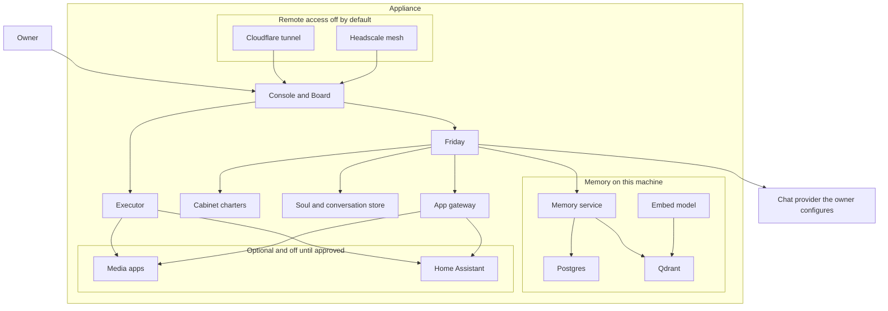
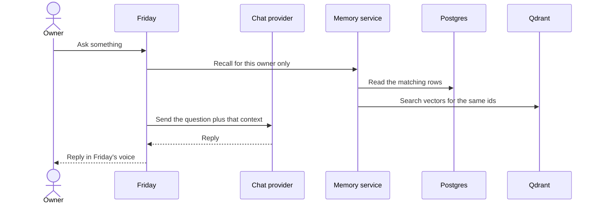
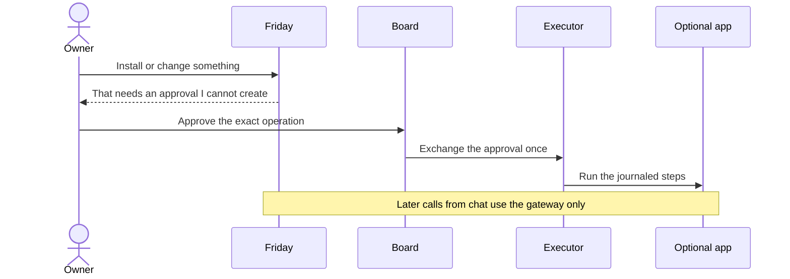

# System architecture

**Status: this is the product we are building. This repository does not
ship it yet.** There is no USB image and no installer. The picture below
is the target. The last section says what the files in this repo implement
today.

Friday OS is a small always-on computer. One assistant, Friday, talks to
the people who use it. A few specialist roles (the Cabinet) share that
same voice. Memory stays on the machine. Extra apps, such as a media
server or Home Assistant, are installed only after an explicit approval,
and they cannot read that memory.

## Why it is split this way

A chat model is good at language and bad at being the root account on a
disk. If the same process that writes replies can also install software,
open a tunnel, or delete a library, a confused or hostile reply becomes
an outage. The split below is the remedy.

| Need | How it is met |
|---|---|
| One place to talk | Friday is the only voice. Advisors are roles of that process, switched for a turn (`@cto`, "ask my cfo"). Installing an app does not create another person to talk to. |
| Answers that remember | Postgres holds the note. Qdrant holds the vector used to find it later. Both carry the same id, and both carry an owner. |
| Notes that do not leak between people or roles | A person and a role never share a namespace. A search without an owner filter is refused. The first release has one owner. A second person, and any shared household pool, wait until isolation checks exist. |
| The model cannot install software by saying so | An install, a grant change, or a backup is a named operation. The owner approves that exact record on the Board or the console. Chat cannot create or exchange the record. A model argument such as `confirmed=true` is ignored. |
| Optional apps stay guests | Apps sit on their own network. Friday is not on that network. An advisor reaches an app only through a gateway that allows the method and path named in that app's wire file. An app cannot open Postgres, Qdrant, or the executor's control port. |
| The machine is not on the internet by default | The console is `127.0.0.1:8080`. A Cloudflare tunnel or a Headscale mesh is a later, separate decision. Memory, Postgres, and the download apps are never given a public name. |
| Chat works before anything else depends on it | The appliance does not ship a chat-sized model. The owner points it at an OpenAI-compatible base URL (a hosted provider, or a server they already run) and names a fast model and, if they want, a separate think model. Setup does not continue until that endpoint returns a real reply. Memory embeddings are separate and local: `nomic-embed-text`, 768 dimensions. |

## The systems

Postgres is the authority for a memory. Qdrant is the search index for
that same id. The embed model only turns text into a vector. The chat
provider is outside the appliance: Friday calls it, and it never receives
the database, the disk, or a shell.

The executor is the only process that creates or changes containers. It
reaches an app directly so it can health-check it and so an approved
operation can run. Friday's later questions ("is the movie downloaded?")
go through the gateway, not through that control path.

## What a question does

A turn addressed to an advisor uses that role's charter and that role's
owner id. It does not open another person's notes. Saving a note writes
the Postgres row and an indexing-queue item in one transaction, then
updates Qdrant. A delete removes the vector. It does not leave a
searchable copy behind.

## What a change to the machine does

The approval names the operation, the app, the reviewed manifest, the
image digest, the mounts, the ports, the privileges, and the network
mode. It expires quickly and can be used once. Any change to those
fields voids it. Mounts have to fall under a storage root the owner
named at setup. The host root, `/etc`, home directories, secrets, the
soul files, the database files, and the Docker socket are refused.
Ports bind to `127.0.0.1` unless a later publication approval says
otherwise.

## Capabilities

| Capability | Systems involved | Why it is a separate piece |
|---|---|---|
| Talk, and switch to a specialist for one turn | Friday, Cabinet charters, soul file | The role is a job description, not an account and not a second memory. |
| Remember and find a note | Memory service, Postgres, Qdrant, embed model | The text and the vector can be updated and deleted together. Search without an owner is refused. |
| See what is installed, healthy, or waiting for a decision | Board | Discovery and approval stay on a screen the model cannot click for you. |
| Install a media stack or Home Assistant | Board, executor, catalog wire, storage root | The wire says which advisor may call which API, which folders are mounted, and which port stays on localhost. |
| Reach the console from another device | Cloudflare tunnel or Headscale, added later | A tunnel is a path to the machine, not a login. It stays off until the owner turns it on. |
| Choose the chat model | Owner-set base URL, API key, fast model, optional think model | The rest of the appliance assumes chat works. Setup checks that with a real reply before continuing. |

Starter roles on the first image are chief, cto, cfo, coach, home, and
media. A larger set ships inactive under `charters/full/` and is enabled
by copying one file into `charters/`. The home and media roles do nothing
useful until the matching app is installed and its tools are granted.
The family role does nothing until a second person exists and a shared
collection has been created on purpose.

## How it is implemented

Compose profiles are the packaging. `core` is always on: Qdrant, the
embed model, Postgres, the memory service. `chat` adds Friday and the
Board. `code`, `edge`, and `mesh` are the later optional profiles
(task runner, tunnel, mesh) and are empty in this repository.

Catalog apps are not written here. A pin records the upstream commit of
the Compose catalog they render from. A wire file next to that pin tells
Friday how to attach: storage under the owner's root, a loopback port,
a health URL, the advisor who receives the tools, and the secret names.
The media bundle installs either Jellyfin or Plex, plus the download
tools, against one shared library. Home Assistant is a separate entry.

Two Docker networks keep the core away from guests. `core` carries
Friday, the Board, Qdrant, Postgres, the embed model, the memory
service, and the executor's control port. `apps` carries optional apps,
a webhook receiver, and the gateway. The executor is the component that
sits on both, because it has to health-check an app by its Compose DNS
name.

## What this repository contains today

| Piece | In the tree now |
|---|---|
| Product rules and this diagram | Written. Target, not a running system. |
| Cabinet charters and an example soul | Written. Generic. No household facts. |
| Memory rules and `sql/memories.sql` | Written. The script that creates collections exits immediately. Nothing calls `memory_save` yet. |
| Compose file | Qdrant, Ollama, and Postgres are real images. Friday, the Board, and the memory service are named and not published. `docker compose up` does not produce a working appliance. |
| App wires | Drafts only. The catalog pin is empty. No renderer or executor reads them. |
| Executor, gateway, `apps` network, approvals | Described. Not in the Compose file. |
| Cloudflare and Headscale | Described, default off. No services in Compose. |
| USB image and installer | Not started. |

Build order, and where we are:

1. Memory schema, env defaults, and collection rules in this repo.
2. Mattermost as an optional door.
3. Starter charters and an example soul.
4. This source snapshot. **We are here.**
5. Executor, recovery, appliance checks, and the USB image.
6. Catalog rendering for the first allowlisted apps.
7. Task runner, tunnel, and mesh profiles.
8. A Helm chart, after Compose is proven.
