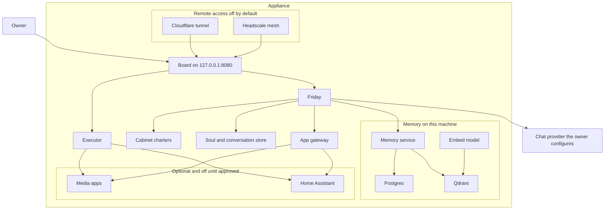
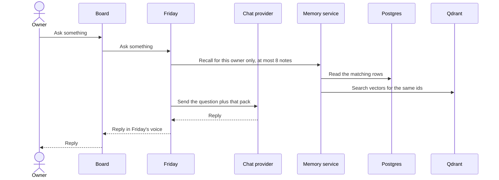
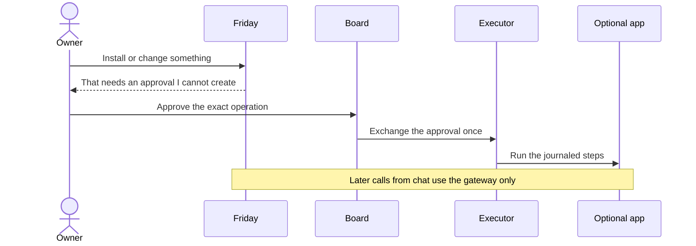

# System architecture

**Status: this is the product we are building. This repository does not
ship it yet.** There is no USB image and no installer. The picture below
is the target. The last section says what the files in this repo implement
today.

Friday OS is a small always-on computer. One assistant, Friday, talks to
the owner. A few specialist roles (the Cabinet) share that same voice.
The first release has one owner. Memory stays on the machine. A turn
still sends a short pack of recalled notes to the chat provider the
owner configured. Extra apps, such as a media player or Home Assistant,
are installed only after an explicit approval, and they cannot read
that memory.

## Why it is split this way

A chat model is good at language and bad at being the root account on a
disk. If the same process that writes replies can also install software,
open a tunnel, or delete a library, a confused or hostile reply becomes
an outage. The split below is the remedy.

| Need | How it is met |
|---|---|
| One place to talk | Friday is the only voice. Advisors are roles of that process, switched for a turn (`@cto`, "ask my cfo"). Installing an app does not create another person to talk to. |
| Answers that remember | Postgres holds the note. Qdrant holds the vector used to find it later. Both carry the same id, and both carry an owner. A turn sends at most 8 of those notes to the chat provider. That pack is the part that leaves the machine. |
| What the model is shown stays evidence | Tool results and fetched pages can be saved as notes. A webhook is stored as a typed event and announced with a fixed sentence. The raw body is not pasted into the prompt as instructions. |
| Notes that do not leak between people or roles | A person and a role never share a namespace. A search without an owner filter is refused, including `knowledge` and findings, and including while there is only one owner. A second person, and any shared household pool, wait until isolation checks exist. |
| The model cannot install software by saying so | An install, a grant change, or a backup is a named operation. The owner approves that exact record on the Board. Chat cannot create or exchange the record. A model argument such as `confirmed=true` is ignored. |
| Optional apps stay guests | Apps sit on their own network. Friday is not on that network. An advisor reaches an app only through a gateway that allows the method and path named in that app's wire file. An app cannot open Postgres, Qdrant, or the executor's control port. An adopted app's address is refused when it resolves to any of those. |
| The machine is not on the internet by default | The Board is the only page on the host, at `127.0.0.1:8080`. Friday has no host port. A Cloudflare tunnel or a Headscale mesh is a later, separate decision. Memory, Postgres, and the download apps are never given a public name. After qBittorrent is installed, its swarm traffic still reaches the public internet. Only its settings page stays on localhost. |
| Chat works before anything else depends on it | The appliance does not ship a chat-sized model. The owner points it at an OpenAI-compatible base URL (a hosted provider, or a server they already run) and names a fast model and, if they want, a separate think model. Setup does not continue until that endpoint returns a real reply. Memory embeddings are separate and local: `nomic-embed-text`, 768 dimensions. |

## The systems

Postgres is the authority for a memory. Qdrant is the search index for
that same id. The embed model only turns text into a vector. Friday does
not hold the Qdrant key. Search and writes go through the memory service,
which applies the owner filter. The owner's browser talks only to the
Board. The Board calls Friday on the internal network.

The chat provider is outside the appliance. Friday calls it with the
question and the recall pack. It never receives the database, the disk,
or a shell.

The executor is the only process that creates or changes containers. It
reaches an app directly so it can health-check it and so an approved
operation can run. Friday's later questions ("is the movie downloaded?")
go through the gateway, not through that control path.

## What a question does

A turn addressed to an advisor uses that role's charter and that role's
owner id. It does not open another person's notes. The provider is sent
the question plus a bounded pack: at most 8 notes, each already trimmed
to a few hundred words, filtered to this owner. `knowledge` and findings
are included only through that same filter. Saving a note writes the
Postgres row and an indexing-queue item in one transaction, then updates
Qdrant. A delete removes the vector. It does not leave a searchable copy
behind. A one-character edit is a new row, because the live identity
includes a hash of the content. The pack cap is what keeps that growth
from being sent out in full.

## What a change to the machine does

The approval names the operation, the app, the reviewed manifest, the
image digest, the mounts, the ports, the privileges, and the network
mode. It expires quickly and can be used once. Any change to those
fields voids it. App mounts have to fall under the app storage disk the
owner names in that approval. That disk is a different device from the
data partition. The data partition holds the machine id, secrets,
Postgres, Qdrant, SQLite, the soul, the executor journal, and free space
for one pre-upgrade backup. Downloads, video files, and app config are
refused there. An upgrade refuses to start when the data partition no
longer has room for that backup. The host root, `/etc`, home
directories, secrets, the soul files, the database files, and the Docker
socket are refused. Ports bind to `127.0.0.1` unless a later publication
approval says otherwise.

The first image target is one x86_64 disk of at least 64 GB: a 512 MB
EFI partition, two 16 GB system slots, and a data partition that fills
the rest, with at least 16 GB free after install so the backup fits. A
movie library does not fit in that remainder.

## First boot

The first release is one owner, at the machine, with a monitor and a
keyboard. A full-screen browser on that screen is the only setup door.
There is no SSH. The machine mints its id and its secrets before it asks
anything, and stores them on the data partition.

The browser can open the setup page only with a provisioning token the
launcher created for that local user. The page shows the Board password
and accepts a display name, a timezone, and one chat endpoint: an
OpenAI-compatible base URL, an API key, a fast model, and an optional
think model. Setup does not finish until that endpoint returns a real
reply, and until the owner confirms they have saved the Board password.
Until that confirmation, every boot returns to the same screen and the
same password. A power loss does not mint a second set. When setup is
complete, the launcher deletes the token and the setup path is gone.
Every other path on port 8080 already requires the Board password.

Embeddings are checked separately, against the local model, and must be
768 dimensions. Apps, a second person, a tunnel, and a mesh are not
questions on this screen.

If the Board password is lost after setup, the owner opens a recovery
prompt from the local keyboard. That prompt is not reachable over the
network. It replaces the Board password and leaves memory and the other
secrets in place. The exact sequence is in [secrets.md](secrets.md).

## Capabilities

| Capability | Systems involved | Why it is a separate piece |
|---|---|---|
| Talk, and switch to a specialist for one turn | Friday, Cabinet charters, soul file | The role is a job description, not an account and not a second memory. |
| Remember and find a note | Memory service, Postgres, Qdrant, embed model | The text and the vector can be updated and deleted together. Search without an owner is refused. The provider receives at most 8 notes. |
| See what is installed, healthy, or waiting for a decision | Board | The Board is the only host page. Discovery and approval stay on a screen the model cannot click for you. |
| Install a media player or Home Assistant | Board, executor, allowlisted wire, app storage disk | Discover can list the pinned catalog. An id installs only after a render test and an approval. Templates that need host networking, a device, or an extra capability stay listed and refused. The media library is a separate disk. |
| Reach the Board from another device | Cloudflare tunnel or Headscale, added later | A tunnel is a path to the Board, not a login. It stays off until the owner turns it on. |
| Choose the chat model | Owner-set base URL, API key, fast model, optional think model | The rest of the appliance assumes chat works. Setup checks that with a real reply before continuing. |

Starter roles on the first image are chief, cto, cfo, coach, home, and
media. A larger set ships inactive under `charters/full/` and is enabled
by copying one file into `charters/`. The home and media roles do nothing
useful until the matching app is installed and its tools are granted.
The family role does nothing until a second person exists and a shared
collection has been created on purpose.

## How it is implemented

Compose profiles are the packaging. `core` is always on: Qdrant, the
embed model, Postgres, the memory service. `chat` adds Friday and the
Board. `code`, `edge`, and `mesh` are the later optional profiles
(task runner, tunnel, mesh) and are empty in this repository.

Catalog apps are not written here. A pin records the upstream commit of
the Compose catalog they render from. That pin is a menu. A wire file
next to it tells Friday how to attach: storage on the app disk, a
loopback port, a health URL, the advisor who receives the tools, and
the secret names. An id installs only when it is on the allowlist and a
render test has passed. The media bundle installs either Jellyfin or
Plex, plus the download tools, against one shared library on the app
disk. Home Assistant is a separate entry. The Board shows measured free
RAM before either approval is offered, and the install is refused when
the declared memory does not fit.

Two Docker networks keep the core away from guests. `core` carries
Friday, the Board, Qdrant, Postgres, the embed model, the memory
service, and the executor's control port. `apps` carries optional apps,
a webhook receiver, and the gateway. The executor is the component that
sits on both, because it has to health-check an app by its Compose DNS
name. The receiver stores a typed event and does not call the executor.
Friday has no published host port. Compose publishes only the Board, at
`127.0.0.1:8080`.

## What this repository contains today

| Piece | In the tree now |
|---|---|
| Product rules and this diagram | Written. Target, not a running system. |
| Cabinet charters and an example soul | Written. Generic. No household facts. |
| Memory rules and `sql/memories.sql` | Written. The script that creates collections exits immediately. Nothing calls `memory_save` yet. |
| Compose file | Qdrant, Ollama, and Postgres are real images. Friday, the Board, and the memory service are named images and are not in a registry. Compose publishes the Board at `127.0.0.1:8080` and publishes no port for Friday. `docker compose up` does not produce a working appliance. |
| App wires | Drafts only. The catalog pin is empty. No renderer or executor reads them. |
| Executor, gateway, `apps` network, approvals | Described. Not in the Compose file. |
| Cloudflare and Headscale | Described, default off. No services in Compose. |
| USB image and installer | Not started. |

Build order, and where we are:

1. Memory schema, env defaults, and collection rules in this repo.
2. Mattermost as an optional door.
3. Starter charters and an example soul.
4. This source snapshot. **We are here.**
5. Executor, recovery, appliance checks, and the USB image.
6. Catalog rendering for the first allowlisted apps.
7. Task runner, tunnel, and mesh profiles.
8. A Helm chart, after Compose is proven.
