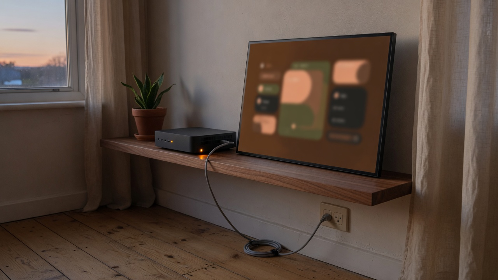
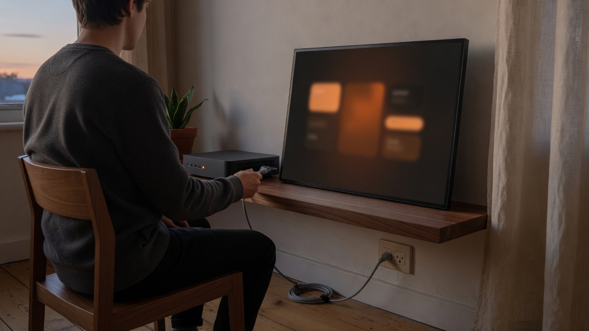
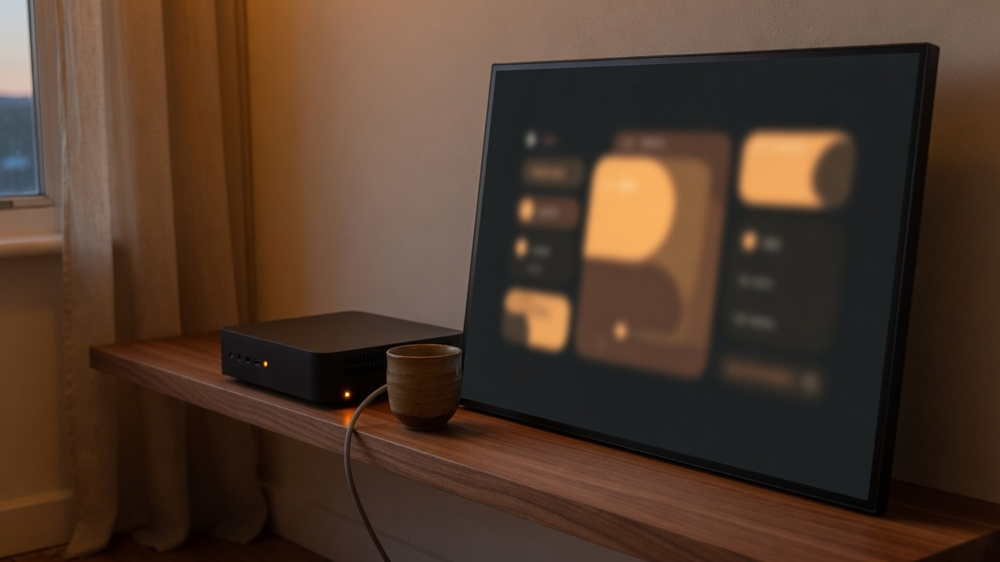
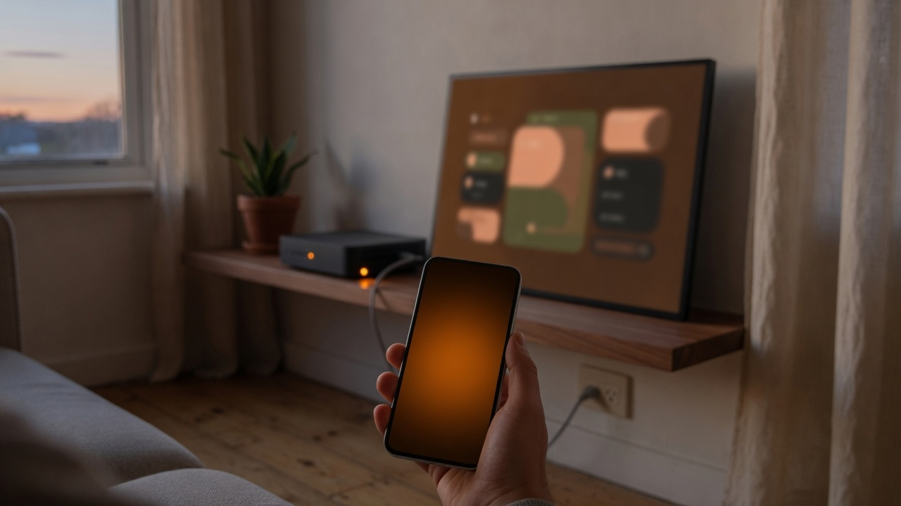
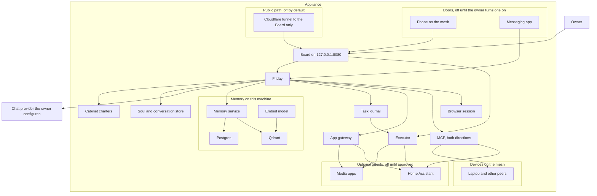
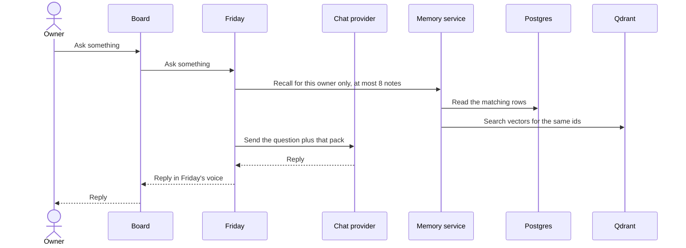
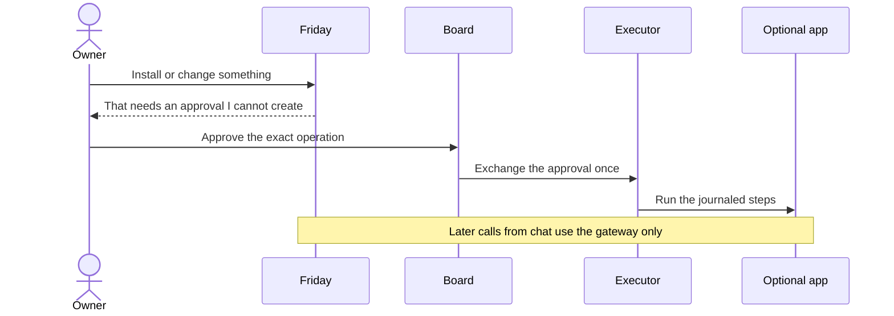
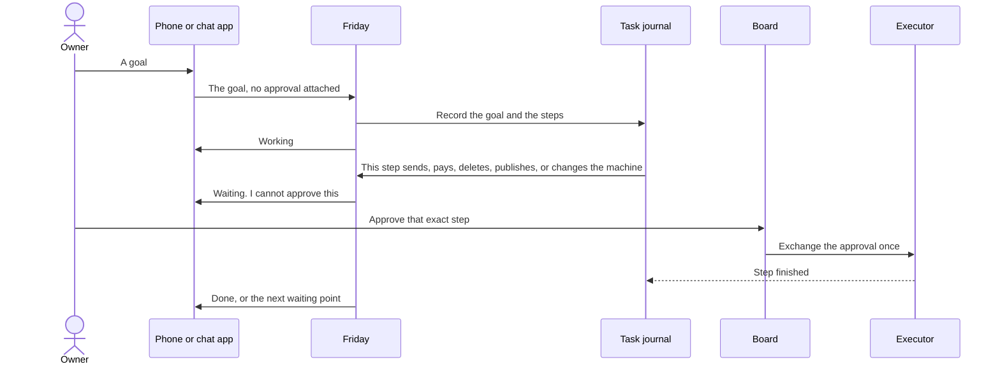

# System architecture

**Status: this is the product we are building. This repository does not
ship it yet.** There is no USB image and no installer. The pictures and
the sections below are the target. The last section says what the files
in this repo implement today.

Friday is the operating system. The release is a disk image for one
computer in the house. You install that image, and the computer runs
Friday. It is not an app you add to another system. Debian and Docker
are how the image is built.

The hosted products in this category are Meta Muse and Grok Bot: the
agent lives on a computer, keeps working after the chat closes, uses
the services the person has connected, and stops for a person before
mail, money, or a machine change goes out. Those products keep that
computer in the vendor's cloud. Friday keeps the computer, and the
operating system, in the house.

One assistant, Friday, talks to the owner. A few specialist roles (the
Cabinet) share that same voice and can carry a task, not only a turn.
The first release has one owner. Memory stays on the machine. A turn
still sends a short pack of recalled notes to the chat provider the
owner configured. The provider is a plug. Friday is not a model.

The owner reaches Friday from a phone and from one messaging app, and
from the Board on the machine. Other AI harnesses connect over MCP, in
both directions, and only for tools the owner has accepted. A site with
no MCP is used through a browser session on this computer. A media
player or Home Assistant can be installed later, only after an explicit
approval, and those apps cannot read the memory. They are guests.

## Why a person would run this

A hosted agent in this category already keeps working after the chat
closes, and it already asks before mail, money, or a machine change
goes out. It does that on a computer the vendor runs. Friday is for
the person who wants that job done on a computer in the house, with
the notes staying there, and with a page they can see.

The computer in that picture is the product. It is not an account on
someone else's machine. One assistant lives on it. A few specialist
roles, the Cabinet, share that same voice. The first release has one
owner.

You need it when three ordinary things are true at once.

- The work should continue after you close the chat. A goal goes into
  a task journal. Friday comes back when a step needs you. Closing the
  phone does not drop the task.
- The assistant should not be the root account. It can draft, recall,
  and use a tool you already allowed. It cannot send, pay, delete,
  publish, install, or change the machine until you approve that exact
  step on the Board.
- The memory should stay on the machine. A turn sends the model at
  most 8 notes, already trimmed, and only notes that belong to you.
  The database, the disk, and a shell are not sent with the question.

The Board is the screen of this operating system. A browser on the
machine draws it at `127.0.0.1:8080`. That address is how the screen is
shown on the box. It is not a website, and it is not a chat app beside
the OS. Open WebUI and LibreChat are not part of Friday. The model is
a plug: any OpenAI-compatible endpoint you already have. Setup does
not name a vendor.

First boot happens on a monitor attached to this computer. There is no
SSH. The page opens before a network link exists. You connect a cable
or join Wi-Fi, then you create the server. Creating the server starts
the core that already shipped in the image, on this computer. Nothing
in that core is downloaded, and the Board stays at `127.0.0.1:8080`.
You then give your name, a timezone, and the model key. Chat stays off
until that key returns a real reply and the local embedding check
returns 768 dimensions.

The image already carries Friday's character and the Cabinet roles, so
it knows its job before you explain it. Your notes start empty. After
you confirm the Board password, the same page becomes the conversation
and Friday speaks first. It asks what you want set up, in ordinary
language. You answer the same way. A later app, a phone, or another
harness is something Friday can ask about then, one confirmed step at
a time. Those are not questions on the setup form.

Reach from the phone comes after that, and only when you turn it on.
The phone opens this same Board over a private mesh. It can ask and it
can approve. It does not join the network that holds the database. A
messaging app can deliver a turn and can say "waiting" or "done". It
cannot approve. A public address is off unless you later turn on a
tunnel, and that tunnel can reach only the Board.

Optional apps, such as a media player or Home Assistant, are guests.
They can be useful. They are not why the computer is there. They
cannot read the memory, and Friday is not on their network.

## The design, stated once

The rest of this page is the same design in more detail. These are the
decisions, in the order a new reader needs them.

| Decision | What it means |
|---|---|
| Friday is the OS | The release is a disk image for one computer in the house. Friday is the agent on that computer. The model is an OpenAI-compatible plug you supply. Embeddings stay local: `nomic-embed-text`, 768 dimensions. |
| The Board is the screen | The OS draws it on a monitor at `127.0.0.1:8080`, as one small Node process. Friday has no second screen and no host port. Open WebUI and LibreChat are not part of the OS. |
| First boot is on the attached monitor | Connect a cable or Wi-Fi. Create the server from the core already in the image. Then name, timezone, and the model key. Confirm the Board password. No SSH. A power loss does not mint a second set of secrets. |
| Friday speaks first | The character and the Cabinet roles ship in the image. Your notes start empty. The first message asks what to set up. A goal that should outlive the turn goes into the task journal. |
| Memory has an owner | Postgres holds the note. Qdrant holds the vector for that same id. A search without an owner is refused. A turn sends at most 8 notes. A delete removes the vector. |
| The model cannot approve itself | Send, pay, delete, publish, install, grant, backup, and any other machine change need an approval record. Only the Board creates and exchanges it. Chat, a messaging door, and an outside harness cannot. `confirmed=true` is ignored. The record expires in ten minutes and works once. Catalog install is refused until a later step opens it. |
| An app event is a fixed sentence | Jellyfin posts `/media`. Radarr and Sonarr post `/arr`, with the header `Friday-Webhook`. Friday may say "A download was grabbed.", "A download failed.", "An app health state changed.", or "An app sent an event." The raw body stays in the log. |
| Later doors cannot become root | The phone opens the Board. A messaging app delivers turns. MCP runs in both directions, and unlisted tools stay out of the prompt. A site with no MCP uses a disposable browser session that cannot see the password or the card. Apps sit on their own network. |
| Two disks, two system slots | The system disk is EFI, slot A, slot B, and a data partition. Movies and app files go on a different disk. An upgrade refuses to start when the data partition no longer has room for one backup. |

What is in this repository today is the last section on this page. The
screen, the USB image, and a running computer are not in it yet.
The memory bootstrap, the approval rules, and the webhook rules are.

## Why it is split this way

A chat model is good at language and bad at being the root account on a
disk. If the same process that writes replies can also install software,
open a tunnel, or delete a library, a confused or hostile reply becomes
an outage. The split below is the remedy.

| Need | How it is met |
|---|---|
| One place to talk | The Board is the screen of the OS. Friday is the only voice. Advisors are roles of that process, switched for a turn (`@cto`, "ask my cfo"). Installing an app does not create another person to talk to. |
| Answers that remember | Postgres holds the note. Qdrant holds the vector used to find it later. Both carry the same id, and both carry an owner. A turn sends at most 8 of those notes to the chat provider. That pack is the part that leaves the machine. |
| What the model is shown stays evidence | Tool results and fetched pages can be saved as notes. A webhook is stored as a typed event and announced with a fixed sentence. The raw body is not pasted into the prompt as instructions. |
| Notes that do not leak between people or roles | A person and a role never share a namespace. A search without an owner filter is refused, including `knowledge` and findings, and including while there is only one owner. A second person, and any shared household pool, wait until isolation checks exist. |
| The model cannot install software by saying so | An install, a grant change, a backup, a send, a payment, a delete, or a publication is a named operation. The owner approves that exact record on the Board. Chat cannot create or exchange the record. A model argument such as `confirmed=true` is ignored. |
| A goal outlives the chat | The task journal holds the goal, the steps, and whether Friday is waiting on the owner. Closing the phone does not drop the task. Friday resumes the same journal after a crash and does not mint a second approval. |
| Reach it from anywhere | The phone opens the Board over the private mesh, so ask and approve both work away from the machine. A messaging app delivers turns and status, and it cannot approve. A public tunnel is optional, off by default, and can only reach the Board. |
| Other harnesses, and the rest of the web | MCP is the bus. Friday calls a granted server, and a granted harness can call Friday. Tools the owner has not accepted are not shown to the model. A site with no MCP is opened in a browser session on this computer. The session is not a shell on the host. |
| Your devices stay peers | The phone, the laptop, and the box join the mesh as machines the owner meant to keep. A peer may expose an MCP endpoint. Friday does not mount that peer's disks, a USB device, or the Docker socket. |
| Optional apps stay guests | Apps sit on their own network. Friday is not on that network. An advisor reaches an app only through a gateway that allows the method and path named in that app's wire file. An app cannot open Postgres, Qdrant, or the executor's control port. An adopted app's address is refused when it resolves to any of those. |
| The machine is not on the internet by default | The Board is the only page on the host, at `127.0.0.1:8080`. Friday has no host port. No door is on until the owner turns it on. Memory, Postgres, and the download apps are never given a public name. After qBittorrent is installed, its swarm traffic still reaches the public internet. Only its settings page stays on localhost. |
| Chat works before anything else depends on it | The appliance does not ship a chat-sized model. The owner points it at an OpenAI-compatible base URL (a hosted provider, or a server they already run) and names a fast model and, if they want, a separate think model. That URL is the model. The screen stays the Board. Setup does not continue until that endpoint returns a real reply. Memory embeddings are separate and local: `nomic-embed-text`, 768 dimensions. |

## The systems

Postgres is the authority for a memory. Qdrant is the search index for
that same id. The embed model only turns text into a vector. Friday does
not hold the Qdrant key. Search and writes go through the memory service,
which applies the owner filter. The owner talks to the Board, on the
machine or from a phone that has joined the mesh. A messaging app talks
to Friday and cannot open the approval path. The Board calls Friday on
the internal network.

The chat provider is outside the appliance. Friday calls it with the
question and the recall pack. It never receives the database, the disk,
or a shell.

## The screen of the OS

The Board is that screen. One small Node process draws it at
`127.0.0.1:8080` and calls Friday at `http://friday:8080` on the
Compose network. Friday has no second screen and no host port.

Open WebUI and LibreChat are not part of the OS. The OpenAI-compatible
base URL is the model, not the screen. Setup names no vendor. The
Board image in `compose.yml` is an unpublished placeholder, so the
screen is not running from this repo yet.
A messaging app is a later door. It delivers turns and cannot approve.
First boot's setup screen is the Board's `/provision` path. It connects
a cable or Wi-Fi, creates the server on this computer, and takes the
model key. When that key returns a real reply, the same page is the
conversation, and Friday speaks first. The sequence is under
[First boot](#first-boot).

The executor is the only process that creates or changes containers. It
reaches an app directly so it can health-check it and so an approved
operation can run. Friday's later questions ("is the movie downloaded?")
go through the gateway, not through that control path. A question for
another harness goes through MCP. A site with no MCP is opened in the
browser session. Neither path can skip the approval record.

## What a question does

A turn addressed to an advisor uses that role's charter and that role's
owner id. It does not open another person's notes. The provider is sent
the question plus a bounded pack: at most 8 notes, each already trimmed
to a few hundred words, filtered to this owner. `knowledge` and findings
are included only through that same filter. Saving a note writes the
Postgres row and an indexing-queue item in one transaction, then updates
Qdrant. A delete removes the vector. It does not leave a searchable copy
behind. A one-character edit is a new row, because the live identity
includes a hash of the content. The pack cap is what keeps that growth
from being sent out in full.

## What a change to the machine does

The approval names the operation, the app, the reviewed manifest, the
image digest, the mounts, the ports, the privileges, and the network
mode. It expires after ten minutes and can be used once. Any change to those
fields voids it. App mounts have to fall under the app storage disk the
owner names in that approval. That disk is a different device from the
data partition. The data partition holds the machine id, secrets,
Postgres, Qdrant, SQLite, the soul, the executor journal, and free space
for one pre-upgrade backup. Downloads, video files, and app config are
refused there. An upgrade refuses to start when the data partition no
longer has room for that backup. The host root, `/etc`, home
directories, secrets, the soul files, the database files, and the Docker
socket are refused. Ports bind to `127.0.0.1` unless a later publication
approval says otherwise.

The first image target is one x86_64 disk of at least 64 GB: a 512 MB
EFI partition, two 16 GB system slots, and a data partition that fills
the rest, with at least 16 GB free after install so the backup fits. A
movie library does not fit in that remainder.

## What a task does

A task is a goal that continues after the reply. "Book Tuesday and tell
me when it needs a card" is a task. "Install Jellyfin" is a machine
change, and it uses the same journal shape. The journal stores the
owner, the role, the goal, the ordered steps, and the state: ready,
running, waiting, done, or blocked.

Drafting, recalling, and reading a tool the owner already granted do not
need a new approval. Sending, paying, deleting, publishing, installing,
changing a grant, and backing up do. The chat process, the messaging
door, and an outside harness cannot create or exchange that record. A
crash resumes the same journal. It does not start a second copy of a
step that already succeeded.

Friday reports waiting and finished tasks on the door the owner used.
The raw page, webhook, or tool body is still evidence. It is not written
into the journal as instructions.

## Doors and devices

| Door | What it can do | What it cannot do |
|---|---|---|
| Board on the machine, `127.0.0.1:8080` | Ask, see health, accept a grant, approve. This is the screen of the OS | It is the only approval screen |
| Phone on the mesh | Open that same Board | Skip the Board password. Join the core network |
| Messaging app | Deliver a turn, and carry "waiting" or "done" back | Create or exchange an approval. Read Postgres |
| Public tunnel | Reach the Board, only after a verified access check, and only if the owner turns it on | Reach Friday's container, memory, Postgres, or Qdrant |

The mesh is how the phone, the laptop, and the box are one private
network. Each long-lived machine is a peer the owner pre-authorizes. A
peer may expose an MCP endpoint, and that endpoint is a grant like any
other. Friday does not mount the peer's disk. An ephemeral code machine
is not one of these peers, and removing it must not remove the phone or
the laptop.

No door is on at first boot. The setup screen is the local keyboard and
monitor. Reach-from-anywhere is turned on afterward, one door at a time.

## MCP

MCP is how Friday talks to other agent harnesses, and how those
harnesses talk to Friday. A catalog wire is the same idea for an app
that is not an MCP server: a named method and path, for one role, off
until accepted.

| Direction | Rule |
|---|---|
| Friday calls out | The server URL, the secret reference, the role, and the tool names are a grant. Tools the grant does not name are not put in the model prompt, even if the server offers them. |
| A harness calls Friday | It presents its own token. Recall uses the same owner filter and the same cap of 8 notes. A call that would send, pay, delete, publish, or change the machine becomes a waiting approval. It does not run. |
| Memory | The caller does not receive the Qdrant key, the database, or a shell. |

A laptop on the mesh reaches Friday's MCP listener. It does not join
the Docker network that holds Postgres. The listener is authenticated.
An accepted tool that later appears under a new name stays off until
the owner accepts the new name. A catalog upgrade follows the same rule.

## Browser session

Most sites have no MCP server and no API. The browser session is how
Friday uses them. It is a disposable browser on this computer, with no
host mount, no host network, and no Docker socket. It is not on the
core network, so a page cannot open Postgres, Qdrant, the memory
service, or the executor.

Credentials for a site stay in the vault. The session receives them
from a broker for that site. The model sees the page as evidence. It
does not see the password or the card. Sending, paying, deleting, and
publishing from the session are waiting steps. They use the same
approval record as an install. Reading and drafting do not.

## First boot

The first release is one owner, at the machine, with a monitor and a
keyboard. A full-screen browser on that screen is the only setup door.
There is no SSH. The machine mints its id and its secrets before it asks
anything, and stores them on the data partition.

The browser can open the setup page only with a provisioning token the
launcher created for that local user. The page opens on that screen
before any network link exists. Every other path on port 8080 already
requires the Board password.

The page then walks through these steps. A power loss returns to the
same step and the same Board password. It does not mint a second set.

1. Connect this computer. Use the cable when a wired link is already up,
   or choose a Wi-Fi network and enter its password. The page shows the
   link. A later boot reuses a saved link. The Wi-Fi password stays on
   the data partition and is not shown again.
2. Create the server. The owner confirms, and the page starts the core
   that shipped in the image: Friday, the Board, memory, and the embed
   model. This computer is the server. Those pieces are not downloaded.
   The Board stays at `127.0.0.1:8080`. No port is opened on the local
   network, and no tunnel or mesh is started.
3. Name, timezone, and the model key: an OpenAI-compatible base URL, an
   API key, a fast model, and an optional think model. Setup names no
   vendor. Chat stays off until that endpoint returns a real, non-empty
   reply. The local embed check must return a 768-dimension vector from
   the pinned model.
4. The owner confirms they have saved the Board password. The launcher
   then deletes the provisioning token and `/provision` returns 404.

The image already carries Friday's character and the Cabinet roles, so
the model knows its job before the owner explains it. The owner's notes
start empty. The same Board then opens the conversation, and Friday
speaks first: it asks what the owner wants set up, in ordinary language.
A goal that should outlive the turn goes into the task journal. Sending,
paying, deleting, publishing, installing, and changing the machine wait
on that page until the owner approves the exact step. The model does not
finish those steps on its own.

The setup page cannot install a catalog app, change a grant, or read
owner memory. A messaging door, the mesh, MCP grants, the browser
session, apps, a second person, and a tunnel are not questions on this
screen. Friday can ask about them in the conversation afterward, one
confirmed operation at a time.

If the Board password is lost after setup, the owner opens a recovery
prompt from the local keyboard. That prompt is not reachable over the
network. It replaces the Board password and leaves memory and the other
secrets in place. The exact sequence is in [secrets.md](secrets.md).

## Capabilities

| Capability | Systems involved | Why it is a separate piece |
|---|---|---|
| Talk, and hand a goal to a role | Friday, Cabinet charters, task journal, soul file | The role is a job description, not an account and not a second memory. The journal is what keeps the goal after the turn ends. After the model key works, Friday speaks first on the Board and asks what to set up. |
| Remember and find a note | Memory service, Postgres, Qdrant, embed model | The text and the vector can be updated and deleted together. Search without an owner is refused. The provider receives at most 8 notes. An MCP caller gets the same filter and the same cap. |
| Approve a send, a payment, a delete, a publication, or a machine change | Board, task journal, executor | The Board is the only approval screen. The phone can open it over the mesh. Chat cannot. |
| Use another AI harness | MCP grants | Both directions. Unaccepted tools stay off. |
| Use a site that has no harness | Browser session, vault | The session is disposable and off the core network. The model does not see the credential. |
| See what is installed, healthy, or waiting | Board | Discovery and approval stay on a screen the model cannot click for you. |
| Install a media player or Home Assistant | Board, executor, allowlisted wire, app storage disk | Optional guests. Discover can list the pinned catalog. An id installs only after a render test and an approval. The media library is a separate disk. |
| Reach the Board from a network you do not control | Cloudflare tunnel, off by default | A tunnel is a path to the Board, not a login, and not the way devices join. The mesh is that way. |
| Choose the chat model | Owner-set base URL, API key, fast model, optional think model | The rest of the appliance assumes chat works. Setup checks that with a real reply before continuing. |

Starter roles on the first image are chief, cto, cfo, coach, home, and
media. A role can carry a task under its own owner id. A larger set
ships inactive under `charters/full/` and is enabled by copying one file
into `charters/`. The home and media roles do nothing useful until the
matching app is installed and its tools are granted. The family role
does nothing until a second person exists and a shared collection has
been created on purpose.

## How it is implemented

Compose profiles are the packaging. `core` is always on: Qdrant, the
embed model, Postgres, the memory service. `chat` adds Friday and the
Board. `code`, `edge`, and `mesh` are later profiles (task runner,
tunnel, mesh) and are empty in this repository. The task journal, the
messaging door, the MCP listener, and the browser session are part of
the product and have no profile in the file yet.

Catalog apps are not written here, and they are not required for the
agent to be useful. A pin records the upstream commit of the Compose
catalog they render from. That pin is a menu of guests. A wire file is
one kind of grant: storage on the app disk, a loopback port, a health
URL, the advisor who receives the tools, and the secret names. An MCP
server the owner adds is the other kind of grant. An id installs only
when it is on the allowlist and a render test has passed. The media
bundle installs either Jellyfin or Plex, plus the download tools,
against one shared library on the app disk. Home Assistant is a
separate entry. The Board shows measured free RAM before either
approval is offered, and the install is refused when the declared
memory does not fit.

Three Docker networks keep the pieces apart in the target. Only `core`
exists in `compose.yml` today. `core` carries Friday, the Board,
Qdrant, Postgres, the embed model, the memory service, and the
executor's control port. `apps` carries optional apps, a webhook
receiver, and the gateway. The browser session sits on its own network,
with a path to the public internet and no path to `core`. The executor
sits on `core` and `apps`, because it has to health-check an app by its
Compose DNS name. `webhooks/receiver.py` and `sql/webhooks.sql` store a
typed event and do not call the executor. Compose has no webhooks
service. A mesh peer reaches the Board and the MCP listener
through an authenticated front. It does not join `core`. Friday has no
published host port. Compose publishes only the Board, at
`127.0.0.1:8080`.

## What this repository contains today

| Piece | In the tree now |
|---|---|
| Product rules and this diagram | Written. Target, not a running system. |
| Cabinet charters and an example soul | Written. Generic. No household facts. |
| Memory rules and `sql/memories.sql` | Written. `scripts/bootstrap-memory.sh` creates the six collections, checks the 768-dimension embed, and applies the SQL. Nothing calls `memory_save` yet. |
| Compose file | Qdrant, Ollama, and Postgres are real images. Friday, the Board, and the memory service are named images and are not in a registry. Compose publishes the Board at `127.0.0.1:8080` and publishes no port for Friday. `docker compose up` does not produce a working appliance. |
| App wires | Drafts only. The catalog pin is empty. No renderer or executor reads them. |
| Approval gate and task journal | `gate/` decides, and `sql/approvals.sql` stores the record. Chat cannot create or exchange an approval. Catalog install is refused. A journal resume does not mint a second approval. |
| Webhook receiver | `webhooks/` checks the `Friday-Webhook` header and classifies the post. `sql/webhooks.sql` stores one typed event. Friday may say one of four fixed sentences. The raw body stays in the log. Compose has no webhooks service and publishes no port for it. |
| Coordinated backup | `backup/` pauses writers, then records Postgres, Qdrant, and SQLite. A live SQLite file is refused. The passphrase stays out of the manifest. Movie files are excluded. A failed upgrade restores that backup before the old system slot boots. Compose has no backup service and this cut does not copy a disk. |
| Executor container, gateway, `apps` network | Described. Not in the Compose file. The gate does not start a container. |
| Messaging door, mesh peers, MCP bus, browser session | Described. Not in the Compose file. Off until the owner turns each one on. |
| Cloudflare tunnel | Described, default off, Board only. No service in Compose. |
| USB image and installer | Not started. |

Build order, and where we are:

1. Memory schema, env defaults, and collection rules in this repo.
2. Mattermost as an optional door. A messaging adapter is the product door. Mattermost is one way to build it, not the product.
3. Starter charters and an example soul.
4. This source snapshot.
5. The gate and the task journal, recovery, appliance checks, and the USB image. **We are here.** Catalog install stays refused. The approval record, the journal resume, the webhook rules, and the coordinated backup are in the tree. The USB image is the rest of this step.
6. Doors and devices. The phone opens the Board over the mesh. One messaging adapter delivers turns and cannot approve.
7. MCP, both directions, allowlist by default.
8. The browser session, behind the same gate.
9. Optional catalog guests, including a media library and Home Assistant.
10. Signed updates the owner can see. Helm only for an existing Kubernetes cluster.
